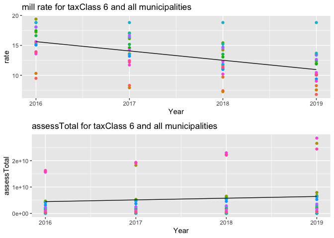
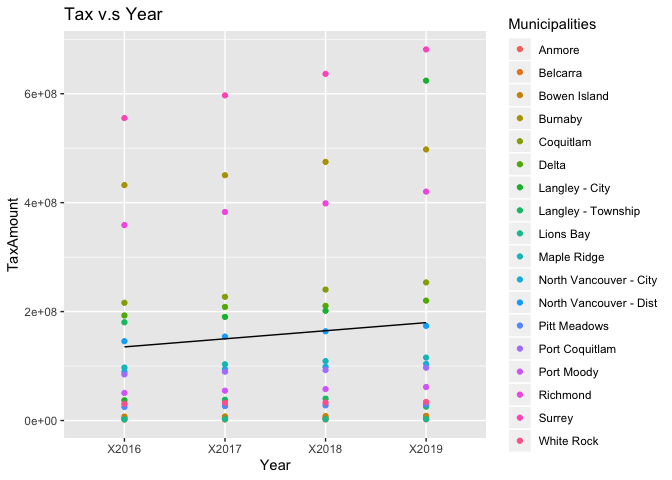
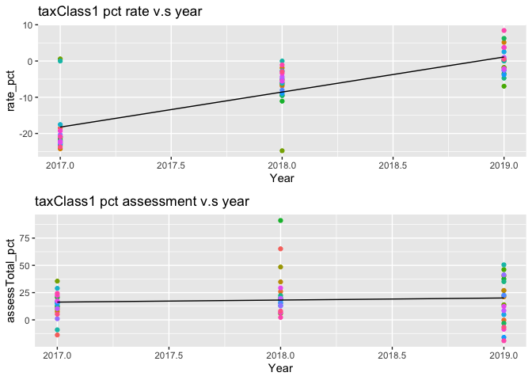
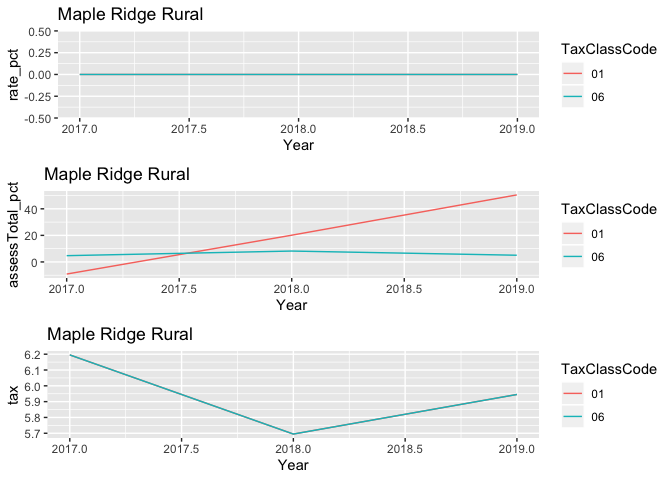
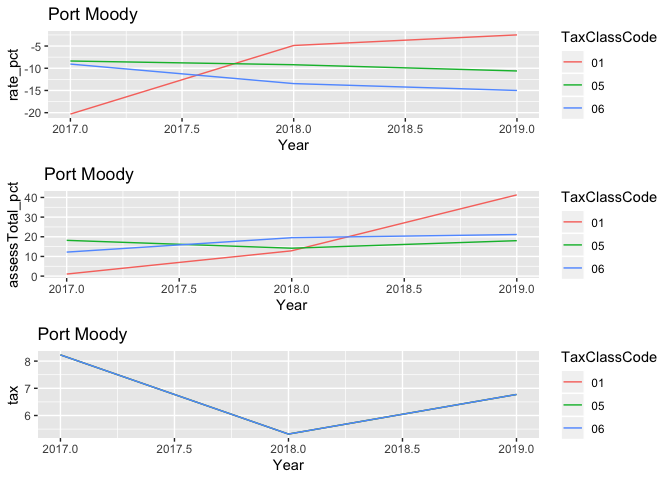
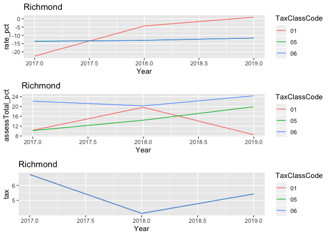
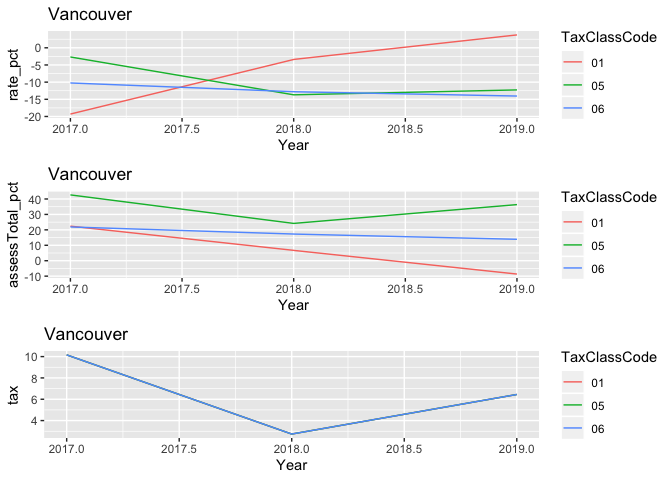
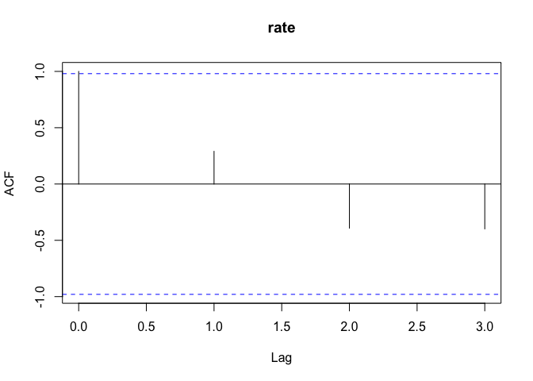
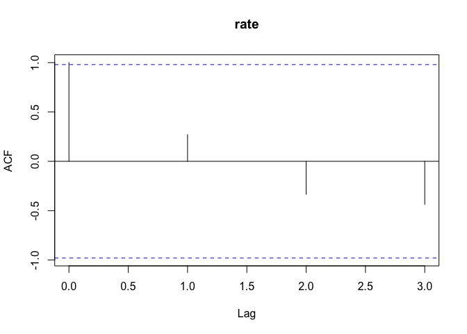

EDA
================
Xuechun Lu, Yuting Wen, Peter Han, Yuetong Liu
25/02/2020

R Markdown
----------

libraries

``` r
library(tidyverse)
library(ggplot2)
library(dplyr)
library(here)
library(readxl)
require(neuralnet)
```

``` r
multiplot <- function(..., plotlist=NULL, file, cols=1, layout=NULL) {
  library(grid)
  # Make a list from the ... arguments and plotlist
  plots <- c(list(...), plotlist)
  numPlots = length(plots)
  # If layout is NULL, then use 'cols' to determine layout
  if (is.null(layout)) {
    # Make the panel
    # ncol: Number of columns of plots
    # nrow: Number of rows needed, calculated from # of cols
    layout <- matrix(seq(1, cols * ceiling(numPlots/cols)),
                    ncol = cols, nrow = ceiling(numPlots/cols))
  }
 if (numPlots==1) {
    print(plots[[1]])
  } else {
    # Set up the page
    grid.newpage()
    pushViewport(viewport(layout = grid.layout(nrow(layout), ncol(layout))))
    # Make each plot, in the correct location
    for (i in 1:numPlots) {
      # Get the i,j matrix positions of the regions that contain this subplot
      matchidx <- as.data.frame(which(layout == i, arr.ind = TRUE))
      print(plots[[i]], vp = viewport(layout.pos.row = matchidx$row,
                                      layout.pos.col = matchidx$col))
    }
  }
}
```

1.  data processing

``` r
# all municipalities
municipality.list = c(
  "Burnaby", 
  "Coquitlam", 
  "Delta", 
  "Langley - City", 
  "Langley - Township",
  "Maple Ridge",
  "Maple Ridge Rural", 
  "North Vancouver - City",
  "North Vancouver - Dist",
  "Pitt Meadows", 
  "Port Coquitlam", 
  "Port Moody", 
  "Richmond", 
  "Surrey", 
  "Vancouver", 
  "White Rock", 
  "West Vancouver", 
  "Bowen Island", 
  "Anmore", 
  "Belcarra",
  "Lions Bay")

# budget and assessment data import and process
tax_pct<-read_csv(here("data", "tax_pct.csv"))
assessment_pct<-read_csv(here("data", "assessment_pct.csv"))
# omit 2016
assessment_pct<-na.omit(assessment_pct)
assessment_pct<-assessment_pct[,-c(1)]
names(assessment_pct)[2]<-paste("Municipalities")
tax_pct<-tax_pct[,-c(1)]
#head(tax_pct)

assessment_aggregate <- read.csv(here("data","assessment_aggregate.csv"))
assessment_final <- read.csv(here("data","assessment_final.csv"))
assessment_final <- assessment_final[,-1]
assessment_final <- assessment_final[complete.cases(assessment_final),]
```

Note: tax\_pct doesn't have Maple Ridge Rural. We decide to treat Maple Ridge Rural and Maple Ridge with the same tax.

2019 tax pct is missing, we imputed 2019 tax by the average of previous tax pct

``` r
tax_pct[,4]<-(tax_pct$pct_2017+tax_pct$pct_2018)/2
#tax_pct
names(tax_pct)[4]<-paste("pct_2019")
tax_pct<-rbind(tax_pct,c("Maple Ridge Rural", 6.195736, 5.6949567,5.945346))

#head(tax_pct)
```

aggregate tax and assessment

``` r
assessment2017<-assessment_pct  %>%  filter(Year=="2017")
tax2017<-tax_pct[,1:2]
assessment2017<-assessment2017 %>% left_join(tax2017, by = c("Municipalities"))
names(assessment2017)[9]<-paste("tax")

assessment2018<-assessment_pct  %>%  filter(Year=="2018")
tax2018<-tax_pct[,c(1,3)]
assessment2018<-assessment2018 %>% left_join(tax2018, by = c("Municipalities"))
names(assessment2018)[9]<-paste("tax")

assessment2019<-assessment_pct  %>%  filter(Year=="2019")
tax2019<-tax_pct[,c(1,4)]
assessment2019<-assessment2019 %>% left_join(tax2019, by = c("Municipalities"))
names(assessment2019)[9]<-paste("tax")

pct_final<-assessment2017 %>% full_join(assessment2018) %>% full_join(assessment2019)
```

    ## Joining, by = c("Year", "Municipalities", "TaxClassCode",
    ## "assessTotal_pct", "landTotal_pct", "improvementTotal_pct",
    ## "propertyCount_pct", "rate_pct", "tax")Joining, by = c("Year",
    ## "Municipalities", "TaxClassCode", "assessTotal_pct", "landTotal_pct",
    ## "improvementTotal_pct", "propertyCount_pct", "rate_pct", "tax")

``` r
pct_final$tax<-as.numeric(pct_final$tax)
write.csv(pct_final, here("data","data_final.csv"))

# all pct data aggregated
#head(pct_final)
```

2019 tax is missing, we imputed 2019 tax using previous values

``` r
tax_final <- read.csv(here("data","tax_final.csv"))
#head(tax_final)

# tax_final is the budget
tax_modified <- tax_final  %>% mutate(X2019=tax_final$X2018*(1+(((tax_final$X2017-tax_final$X2016)/tax_final$X2016 + (tax_final$X2018-tax_final$X2017)/tax_final$X2017)/2)))

# tax_modified contains all the budget values from 2016 to 2019
#head(tax_modified)
```

global variables

``` r
# all pct aggregated
pct_final
```

    ## # A tibble: 165 x 9
    ##     Year Municipalities TaxClassCode assessTotal_pct landTotal_pct
    ##    <dbl> <chr>          <chr>                  <dbl>         <dbl>
    ##  1  2017 Anmore         01                   -13.9          -0.380
    ##  2  2017 Anmore         06                    10.3          45.4  
    ##  3  2017 Belcarra       01                    12.2          14.7  
    ##  4  2017 Bowen Island   01                     7.59         12.9  
    ##  5  2017 Bowen Island   05                    -0.490         0    
    ##  6  2017 Bowen Island   06                    14.7          37.5  
    ##  7  2017 Burnaby        01                    12.0          25.4  
    ##  8  2017 Burnaby        05                    17.5          31.0  
    ##  9  2017 Burnaby        06                    15.1          23.9  
    ## 10  2017 Coquitlam      01                     9.80         11.9  
    ## # ... with 155 more rows, and 4 more variables:
    ## #   improvementTotal_pct <dbl>, propertyCount_pct <dbl>, rate_pct <dbl>,
    ## #   tax <dbl>

``` r
# all budget values
tax_modified
```

    ##     X         Municipalities      X2016      X2017      X2018      X2019
    ## 1   1                 Anmore    4265156    4627081    4881334    5222552
    ## 2   2               Belcarra    1855564    1931623    2067747    2182984
    ## 3   3           Bowen Island    7219146    7497379    8121276    8615684
    ## 4   4                Burnaby  432220186  450355493  474814512  497669462
    ## 5   5              Coquitlam  216182822  227096791  240417810  253537746
    ## 6   6                  Delta  192862492  208509386  210564865  220144278
    ## 7   7         Langley - City   37056327  190218801  201523378  623983226
    ## 8   8     Langley - Township  180361779   38227355   40259997   25466877
    ## 9   9              Lions Bay    2152138    2337089    2459587    2629733
    ## 10 10            Maple Ridge   97232843  103257133  109137582  115626189
    ## 11 11 North Vancouver - City   89284753   94275663   98708171  103787459
    ## 12 12 North Vancouver - Dist  145586665  154117460  163829833  173791939
    ## 13 13           Pitt Meadows   24871507   26483421   27853805   29477050
    ## 14 14         Port Coquitlam   84721363   89609311   92674259   96932542
    ## 15 15             Port Moody   50587243   54750183   57661906   61567758
    ## 16 16               Richmond  358738675  382830769  398658518  420286095
    ## 17 17                 Surrey  555370000  597000000  636460000  681348311
    ## 18 18              Vancouver 1357194000 1495095000 1536009000 1635060782
    ## 19 19         West Vancouver  122852194  130516395  131670339  136359575
    ## 20 20             White Rock   30725883   32348682   32939664   34110414

check match between budget and assessTotal\*mill\_rate

``` r
# get predicted tax income for all tax classes and each municipality
assessment_aggregate[,10] <- assessment_aggregate$assessTotal*assessment_aggregate$rate/1000
names(assessment_aggregate)[10] <- paste("predTaxIncome")

dat_pred_income <- assessment_aggregate %>% select(Year,AddressAssessorMunicipalityDesc,TaxClassCode,predTaxIncome)
dat_pred_income <- aggregate(dat_pred_income$predTaxIncome,by=list(Year=dat_pred_income$Year,Municipalities=dat_pred_income$AddressAssessorMunicipalityDesc),FUN=sum)
names(dat_pred_income)[3] <- paste("predTaxIncome")

tax_refactored <- tax_modified
names(tax_refactored)[3] <- paste("2016")
names(tax_refactored)[4] <- paste("2017")
names(tax_refactored)[5] <- paste("2018")
names(tax_refactored)[6] <- paste("2019")
dat_true_income <- gather(tax_refactored, Year, TaxAmount, "2016":"2019", factor_key=TRUE)
dat_true_income <- dat_true_income[,-1]

income_budget_compare <- merge(dat_true_income,dat_pred_income,by=c("Municipalities","Year"))
income_budget_compare <- gather(income_budget_compare, TaxType, Amount, TaxAmount:predTaxIncome, factor_key=TRUE)

compare_full_plot <- income_budget_compare %>% filter(Municipalities!="Vancouver") %>% ggplot(aes(x=Year,y=Amount,group=interaction(Municipalities,TaxType),color=Municipalities)) + geom_line()

compare_plot <- income_budget_compare %>% filter(Municipalities=="Vancouver" | Municipalities=="Surrey" | Municipalities=="Burnaby" | Municipalities=="Richmond") %>% ggplot(aes(x=Year,y=Amount,group=interaction(Municipalities,TaxType),color=TaxType)) + geom_line() + ggtitle("budget v.s taxIncome")
compare_plot
```


1.  plots of mill rate v.s assessments for each tax class

``` r
# mill rate vesus year for each municipality and tax class
dat_rate <- assessment_aggregate %>% select(Year, AddressAssessorMunicipalityDesc, TaxClassCode, rate)
#head(dat_rate)

dat_rate_1 <- dat_rate %>% filter(AddressAssessorMunicipalityDesc %in% municipality.list) %>% filter(TaxClassCode=="1") 
dat_rate_5 <- dat_rate %>% filter(AddressAssessorMunicipalityDesc %in% municipality.list) %>% filter(TaxClassCode=="5") 
dat_rate_6 <- dat_rate %>% filter(AddressAssessorMunicipalityDesc %in% municipality.list) %>% filter(TaxClassCode=="6") 

# plot assessed value vesus year for each municipality and tax class
dat_assess <- assessment_aggregate %>% select(Year, AddressAssessorMunicipalityDesc, TaxClassCode, assessTotal)

dat_assess_1 <- dat_assess %>% filter(AddressAssessorMunicipalityDesc %in% municipality.list) %>% filter(TaxClassCode=="1") 
dat_assess_5 <- dat_assess %>% filter(AddressAssessorMunicipalityDesc %in% municipality.list) %>% filter(TaxClassCode=="5") 
dat_assess_6 <- dat_assess %>% filter(AddressAssessorMunicipalityDesc %in% municipality.list) %>% filter(TaxClassCode=="6") 

# plot budgets vesus year
dat_tax_long <- gather(tax_modified, Year, TaxAmount, X2016:X2019, factor_key=TRUE)

# Vancouver/West Vancouver are special cases for assessment, we omit them for taxClass 1 and 6
rate_class1 <- dat_rate_1 %>% filter(AddressAssessorMunicipalityDesc != "Vancouver" & AddressAssessorMunicipalityDesc != "West Vancouver") %>% ggplot(aes(x=Year,y=rate,group=AddressAssessorMunicipalityDesc,color=AddressAssessorMunicipalityDesc)) + geom_point() + ggtitle("mill rate for taxClass 1 and all municipalities") + geom_smooth(aes(group = 1), size = 0.5, method = "lm", se = FALSE, colour = "black")

assess_class1 <- dat_assess_1 %>% filter(AddressAssessorMunicipalityDesc != "Vancouver" & AddressAssessorMunicipalityDesc != "West Vancouver") %>% ggplot(aes(x=Year,y=assessTotal,group=AddressAssessorMunicipalityDesc,color=AddressAssessorMunicipalityDesc)) + geom_point() + ggtitle("assessTotal for taxClass 1 and all municipalities") + geom_smooth(aes(group = 1), size = 0.5, method = "lm", se = FALSE, colour = "black")

multiplot(rate_class1 + theme(legend.position = "none"), assess_class1 + theme(legend.position = "none"))
```


``` r
rate_class5 <- dat_rate_5 %>% ggplot(aes(x=Year,y=rate,group=AddressAssessorMunicipalityDesc,color=AddressAssessorMunicipalityDesc)) + geom_point() + ggtitle("mill rate for taxClass 5") + geom_smooth(aes(group = 1), size = 0.5, method = "lm", se = FALSE, colour = "black")

assess_class5 <- dat_assess_5 %>% ggplot(aes(x=Year,y=assessTotal,group=AddressAssessorMunicipalityDesc,color=AddressAssessorMunicipalityDesc)) + geom_point() + ggtitle("assessTotal for taxClass 5") + geom_smooth(aes(group = 1), size = 0.5, method = "lm", se = FALSE, colour = "black")

multiplot(rate_class5 + theme(legend.position = "none"),assess_class5 + theme(legend.position = "none"))
```


``` r
rate_class6 <- dat_rate_6 %>% filter(AddressAssessorMunicipalityDesc != "Vancouver" & AddressAssessorMunicipalityDesc != "West Vancouver") %>% ggplot(aes(x=Year,y=rate,group=AddressAssessorMunicipalityDesc,color=AddressAssessorMunicipalityDesc)) + geom_point() + ggtitle("mill rate for taxClass 6 and all municipalities") + geom_smooth(aes(group = 1), size = 0.5, method = "lm", se = FALSE, colour = "black")

assess_class6 <- dat_assess_6 %>% filter(AddressAssessorMunicipalityDesc != "Vancouver" & AddressAssessorMunicipalityDesc != "West Vancouver") %>% ggplot(aes(x=Year,y=assessTotal,group=AddressAssessorMunicipalityDesc,color=AddressAssessorMunicipalityDesc)) + geom_point() + ggtitle("assessTotal for taxClass 6 and all municipalities") + geom_smooth(aes(group = 1), size = 0.5, method = "lm", se = FALSE, colour = "black")

multiplot(rate_class6 + theme(legend.position = "none"),assess_class6 + theme(legend.position = "none"))
```



``` r
budget_plot <- dat_tax_long %>% filter(Municipalities != "Vancouver" & Municipalities != "West Vancouver") %>% ggplot(aes(x=Year,y=TaxAmount,group=Municipalities,color=Municipalities)) + geom_point() + ggtitle("Tax v.s Year") + geom_smooth(aes(group = 1), size = 0.5, method = "lm", se = FALSE, colour = "black")
budget_plot
```



1.  plots of mill rate pct change v.s assessment pct change for each tax class

``` r
pct_rate1 <- pct_final %>% 
  filter(Municipalities %in% municipality.list) %>%
  filter(TaxClassCode == "01") %>%
  ggplot(aes(x=Year, y=rate_pct, group=Municipalities, color=Municipalities)) +
    geom_point() + ggtitle("taxClass1 pct rate v.s year") + theme(legend.position = "none") + geom_smooth(aes(group = 1), size = 0.5, method = "lm", se = FALSE, colour = "black")

pct_rate5 <- pct_final %>% 
  filter(Municipalities %in% municipality.list) %>%
  filter(TaxClassCode == "05") %>%
  ggplot(aes(x=Year, y=rate_pct, group=Municipalities, color=Municipalities)) +
    geom_point() + ggtitle("taxClass5 pct rate v.s year") + theme(legend.position = "none") + geom_smooth(aes(group = 1), size = 0.5, method = "lm", se = FALSE, colour = "black")

pct_rate6 <- pct_final %>% 
  filter(Municipalities %in% municipality.list) %>%
  filter(TaxClassCode == "06") %>%
  ggplot(aes(x=Year, y=rate_pct, group=Municipalities, color=Municipalities)) +
    geom_point() + ggtitle("taxClass6 pct rate v.s year") + theme(legend.position = "none") + geom_smooth(aes(group = 1), size = 0.5, method = "lm", se = FALSE, colour = "black")

pct_assess1 <- pct_final %>% 
  filter(Municipalities %in% municipality.list) %>%
  filter(TaxClassCode == "01") %>%
  ggplot(aes(x=Year, y=assessTotal_pct, group=Municipalities, color=Municipalities)) +
    geom_point() + ggtitle("taxClass1 pct assessment v.s year") + theme(legend.position = "none") + geom_smooth(aes(group = 1), size = 0.5, method = "lm", se = FALSE, colour = "black")

pct_assess5 <- pct_final %>% 
  filter(Municipalities %in% municipality.list) %>%
  filter(TaxClassCode == "05") %>%
  ggplot(aes(x=Year, y=assessTotal_pct, group=Municipalities, color=Municipalities)) +
    geom_point() + ggtitle("taxClass5 pct assessment v.s year") + theme(legend.position = "none") + geom_smooth(aes(group = 1), size = 0.5, method = "lm", se = FALSE, colour = "black")

pct_assess6 <- pct_final %>% 
  filter(Municipalities %in% municipality.list) %>%
  filter(TaxClassCode == "06") %>%
  ggplot(aes(x=Year, y=assessTotal_pct, group=Municipalities, color=Municipalities)) +
    geom_point() + ggtitle("taxClass6 pct assessment v.s year") + theme(legend.position = "none") + geom_smooth(aes(group = 1), size = 0.5, method = "lm", se = FALSE, colour = "black")

multiplot(pct_rate1,pct_assess1)
```



``` r
multiplot(pct_rate5,pct_assess5)
```


``` r
multiplot(pct_rate6,pct_assess6)
```


1.  pct change of mill rate and assessment for each municipality

``` r
# for each municipality
tax.list <- c("01","05","06")
for (i in 1:21){
  if (municipality.list[i] != "Lions Bay") {
    plot_rate_pct <- pct_final %>% filter(Municipalities == municipality.list[i]) %>% 
    filter(TaxClassCode %in% tax.list) %>% 
    ggplot(aes(x=Year, y=rate_pct, group=TaxClassCode, color=TaxClassCode)) +
      geom_line() + ggtitle(municipality.list[i])
    
    plot_assess_pct <- pct_final %>% filter(Municipalities == municipality.list[i]) %>% 
    filter(TaxClassCode %in% tax.list) %>% 
    ggplot(aes(x=Year, y=assessTotal_pct, group=TaxClassCode, color=TaxClassCode)) +
      geom_line() + ggtitle(municipality.list[i])
    
    plot_tax_pct <- pct_final %>% filter(Municipalities == municipality.list[i]) %>% 
  filter(TaxClassCode %in% tax.list) %>% 
  ggplot(aes(x=Year, y=tax, group=TaxClassCode, color=TaxClassCode)) +
    geom_line() + ggtitle(municipality.list[i])
    
    multiplot(plot_rate_pct,plot_assess_pct,plot_tax_pct)
  }
}
```



1.  box plots of mill rates, grouped by region

``` r
rate_boxes <- ggplot(dat_rate, aes(x=AddressAssessorMunicipalityDesc,y=rate,fill=TaxClassCode)) + geom_boxplot() + facet_wrap(~TaxClassCode) + theme(axis.text.x = element_text(angle = 90, hjust = 1), legend.position = "none")
rate_boxes 
```


1.  Test correlations between past mill rates and assessed values and government budget.

``` r
# aggregate tax and mill rate & assessment
colnames(tax_modified) <- c("X","Municipalities","2016","2017","2018","2019")
dat_tax_long <- gather(tax_modified, Year, TaxAmount, "2016":"2019", factor_key=TRUE)

tax_modified1 <- gather(tax_modified, Year, tax, '2016':'2019', factor_key = TRUE)%>%
  rename(AddressAssessorMunicipalityDesc = Municipalities)

assessment_aggregate <- merge(assessment_aggregate, tax_modified1, by = c("AddressAssessorMunicipalityDesc","Year"))
assessment_aggregate <- assessment_aggregate[,-c(3,11)]
names(assessment_aggregate)[10] <- paste("tax")

# correlation between mill rate and budget for each municipality
rate_tax_correlation <- assessment_aggregate %>%
  group_by(AddressAssessorMunicipalityDesc,TaxClassCode)%>%
  summarise(cor(rate, tax))
rate_tax_correlation
```

    ## # A tibble: 56 x 3
    ## # Groups:   AddressAssessorMunicipalityDesc [20]
    ##    AddressAssessorMunicipalityDesc TaxClassCode `cor(rate, tax)`
    ##    <fct>                                  <int>            <dbl>
    ##  1 Anmore                                     1           -0.879
    ##  2 Anmore                                     6           -0.990
    ##  3 Belcarra                                   1           -0.765
    ##  4 Belcarra                                   6           -1    
    ##  5 Bowen Island                               1           -0.625
    ##  6 Bowen Island                               5           -0.735
    ##  7 Bowen Island                               6           -0.759
    ##  8 Burnaby                                    1           -0.821
    ##  9 Burnaby                                    5           -0.997
    ## 10 Burnaby                                    6           -0.997
    ## # ... with 46 more rows

``` r
# correlation between mill rate and assessment
rate_assess_correlation2 <- assessment_aggregate %>%
  group_by(AddressAssessorMunicipalityDesc,TaxClassCode)%>%
  summarise(cor(assessTotal, rate))
rate_assess_correlation2
```

    ## # A tibble: 56 x 3
    ## # Groups:   AddressAssessorMunicipalityDesc [20]
    ##    AddressAssessorMunicipalityDesc TaxClassCode `cor(assessTotal, rate)`
    ##    <fct>                                  <int>                    <dbl>
    ##  1 Anmore                                     1                   -0.580
    ##  2 Anmore                                     6                   -0.993
    ##  3 Belcarra                                   1                   -0.848
    ##  4 Belcarra                                   6                    1.00 
    ##  5 Bowen Island                               1                   -0.539
    ##  6 Bowen Island                               5                   -0.640
    ##  7 Bowen Island                               6                   -0.872
    ##  8 Burnaby                                    1                   -0.720
    ##  9 Burnaby                                    5                   -0.980
    ## 10 Burnaby                                    6                   -0.991
    ## # ... with 46 more rows

1.  Compute autocorrelations of past mill rates to test the independence of mill rates.

``` r
# all white noise
for (i in 1:21) {
  print(municipality.list[i])
  dat_tmp <- dat_rate %>% filter(AddressAssessorMunicipalityDesc %in% municipality.list[i] & TaxClassCode %in% "1") %>% select(rate)
  if (municipality.list[i] != "Maple Ridge Rural") {
    as.ts(dat_tmp)
    acf(dat_tmp)
  }
}
```

    ## [1] "Burnaby"


    ## [1] "Coquitlam"


    ## [1] "Delta"


    ## [1] "Langley - City"


    ## [1] "Langley - Township"


    ## [1] "Maple Ridge"


    ## [1] "Maple Ridge Rural"
    ## [1] "North Vancouver - City"


    ## [1] "North Vancouver - Dist"


    ## [1] "Pitt Meadows"


    ## [1] "Port Coquitlam"


    ## [1] "Port Moody"


    ## [1] "Richmond"


    ## [1] "Surrey"


    ## [1] "Vancouver"


    ## [1] "White Rock"


    ## [1] "West Vancouver"


    ## [1] "Bowen Island"


    ## [1] "Anmore"


    ## [1] "Belcarra"


    ## [1] "Lions Bay"


``` r
for (i in 1:21) {
  print(municipality.list[i])
  dat_tmp <- dat_rate %>% filter(AddressAssessorMunicipalityDesc %in% municipality.list[i] & TaxClassCode %in% "5") %>% select(rate)
  if (municipality.list[i] != "Maple Ridge Rural" & municipality.list[i] != "White Rock" & municipality.list[i] != "Anmore" & municipality.list[i] != "Belcarra" & municipality.list[i] != "Lions Bay") {
    as.ts(dat_tmp)
    acf(dat_tmp)
  }
}
```

    ## [1] "Burnaby"


    ## [1] "Coquitlam"


    ## [1] "Delta"


    ## [1] "Langley - City"


    ## [1] "Langley - Township"


    ## [1] "Maple Ridge"


    ## [1] "Maple Ridge Rural"
    ## [1] "North Vancouver - City"


    ## [1] "North Vancouver - Dist"



    ## [1] "Pitt Meadows"


    ## [1] "Port Coquitlam"


    ## [1] "Port Moody"


    ## [1] "Richmond"


    ## [1] "Surrey"


    ## [1] "Vancouver"


    ## [1] "White Rock"
    ## [1] "West Vancouver"


    ## [1] "Bowen Island"


    ## [1] "Anmore"
    ## [1] "Belcarra"
    ## [1] "Lions Bay"

``` r
for (i in 1:21) {
  print(municipality.list[i])
  dat_tmp <- dat_rate %>% filter(AddressAssessorMunicipalityDesc %in% municipality.list[i] & TaxClassCode %in% "6") %>% select(rate)
  if (municipality.list[i] != "Maple Ridge Rural") {
    as.ts(dat_tmp)
    acf(dat_tmp)
  }
}
```

    ## [1] "Burnaby"


    ## [1] "Coquitlam"



    ## [1] "Delta"


    ## [1] "Langley - City"


    ## [1] "Langley - Township"


    ## [1] "Maple Ridge"


    ## [1] "Maple Ridge Rural"
    ## [1] "North Vancouver - City"


    ## [1] "North Vancouver - Dist"


    ## [1] "Pitt Meadows"


    ## [1] "Port Coquitlam"


    ## [1] "Port Moody"


    ## [1] "Richmond"


    ## [1] "Surrey"


    ## [1] "Vancouver"


    ## [1] "White Rock"


    ## [1] "West Vancouver"


    ## [1] "Bowen Island"


    ## [1] "Anmore"


    ## [1] "Belcarra"

    ## [1] "Lions Bay"


model fitting (i) linear model Not too much difference between linear 1 and linear 2 (with and without year). This probably implies adding year doesn't make a difference.

``` r
linear1<-lm(rate_pct~factor(Year)+factor(TaxClassCode)+factor(Municipalities)+assessTotal_pct+tax,data=pct_final)
summary(linear1)
```

    ## 
    ## Call:
    ## lm(formula = rate_pct ~ factor(Year) + factor(TaxClassCode) + 
    ##     factor(Municipalities) + assessTotal_pct + tax, data = pct_final)
    ## 
    ## Residuals:
    ##      Min       1Q   Median       3Q      Max 
    ## -30.7466  -3.7315  -0.1044   4.4099  29.4530 
    ## 
    ## Coefficients:
    ##                                                Estimate Std. Error t value
    ## (Intercept)                                  -1.169e+01  3.241e+00  -3.607
    ## factor(Year)2018                              5.159e+00  1.443e+00   3.576
    ## factor(Year)2019                              6.761e+00  1.407e+00   4.805
    ## factor(TaxClassCode)05                       -1.966e+00  1.491e+00  -1.319
    ## factor(TaxClassCode)06                       -2.527e+00  1.348e+00  -1.875
    ## factor(Municipalities)Belcarra               -1.938e+00  4.743e+00  -0.409
    ## factor(Municipalities)Bowen Island            1.198e+00  3.882e+00   0.309
    ## factor(Municipalities)Burnaby                -2.018e+00  3.876e+00  -0.521
    ## factor(Municipalities)Coquitlam              -2.859e+00  3.877e+00  -0.737
    ## factor(Municipalities)Delta                   9.035e-01  3.871e+00   0.233
    ## factor(Municipalities)Langley - City         -2.415e+00  4.873e+00  -0.496
    ## factor(Municipalities)Langley - Township     -1.302e+00  3.946e+00  -0.330
    ## factor(Municipalities)Lions Bay               4.832e+00  6.067e+00   0.796
    ## factor(Municipalities)Maple Ridge            -1.352e+00  3.871e+00  -0.349
    ## factor(Municipalities)Maple Ridge Rural       9.216e+00  4.215e+00   2.186
    ## factor(Municipalities)North Vancouver - City -3.473e+00  3.874e+00  -0.897
    ## factor(Municipalities)North Vancouver - Dist -2.719e+00  3.871e+00  -0.702
    ## factor(Municipalities)Pitt Meadows           -1.437e-01  3.879e+00  -0.037
    ## factor(Municipalities)Port Coquitlam         -6.486e-01  3.872e+00  -0.168
    ## factor(Municipalities)Port Moody             -8.454e-01  3.871e+00  -0.218
    ## factor(Municipalities)Richmond               -1.865e+00  3.871e+00  -0.482
    ## factor(Municipalities)Surrey                 -6.263e-01  3.871e+00  -0.162
    ## factor(Municipalities)Vancouver               1.652e-01  3.872e+00   0.043
    ## factor(Municipalities)West Vancouver          1.015e+00  4.230e+00   0.240
    ## factor(Municipalities)White Rock             -2.423e-01  4.223e+00  -0.057
    ## assessTotal_pct                              -1.781e-02  4.064e-02  -0.438
    ## tax                                          -1.006e-04  1.462e-02  -0.007
    ##                                              Pr(>|t|)    
    ## (Intercept)                                  0.000432 ***
    ## factor(Year)2018                             0.000482 ***
    ## factor(Year)2019                             3.98e-06 ***
    ## factor(TaxClassCode)05                       0.189430    
    ## factor(TaxClassCode)06                       0.062883 .  
    ## factor(Municipalities)Belcarra               0.683418    
    ## factor(Municipalities)Bowen Island           0.757977    
    ## factor(Municipalities)Burnaby                0.603398    
    ## factor(Municipalities)Coquitlam              0.462117    
    ## factor(Municipalities)Delta                  0.815816    
    ## factor(Municipalities)Langley - City         0.620989    
    ## factor(Municipalities)Langley - Township     0.741888    
    ## factor(Municipalities)Lions Bay              0.427185    
    ## factor(Municipalities)Maple Ridge            0.727421    
    ## factor(Municipalities)Maple Ridge Rural      0.030468 *  
    ## factor(Municipalities)North Vancouver - City 0.371516    
    ## factor(Municipalities)North Vancouver - Dist 0.483598    
    ## factor(Municipalities)Pitt Meadows           0.970505    
    ## factor(Municipalities)Port Coquitlam         0.867198    
    ## factor(Municipalities)Port Moody             0.827459    
    ## factor(Municipalities)Richmond               0.630781    
    ## factor(Municipalities)Surrey                 0.871700    
    ## factor(Municipalities)Vancouver              0.966025    
    ## factor(Municipalities)West Vancouver         0.810824    
    ## factor(Municipalities)White Rock             0.954332    
    ## assessTotal_pct                              0.661973    
    ## tax                                          0.994520    
    ## ---
    ## Signif. codes:  0 '***' 0.001 '**' 0.01 '*' 0.05 '.' 0.1 ' ' 1
    ## 
    ## Residual standard error: 7.296 on 138 degrees of freedom
    ## Multiple R-squared:  0.265,  Adjusted R-squared:  0.1265 
    ## F-statistic: 1.914 on 26 and 138 DF,  p-value: 0.009046

``` r
linear2<-lm(rate_pct~factor(TaxClassCode)+factor(Municipalities)+assessTotal_pct+tax,data=pct_final)
summary(linear2)
```

    ## 
    ## Call:
    ## lm(formula = rate_pct ~ factor(TaxClassCode) + factor(Municipalities) + 
    ##     assessTotal_pct + tax, data = pct_final)
    ## 
    ## Residuals:
    ##     Min      1Q  Median      3Q     Max 
    ## -28.000  -2.099   0.486   3.770  30.658 
    ## 
    ## Coefficients:
    ##                                               Estimate Std. Error t value
    ## (Intercept)                                  -7.868542   3.392541  -2.319
    ## factor(TaxClassCode)05                       -1.929473   1.607604  -1.200
    ## factor(TaxClassCode)06                       -2.415798   1.453261  -1.662
    ## factor(Municipalities)Belcarra               -1.136765   5.110602  -0.222
    ## factor(Municipalities)Bowen Island            1.261403   4.186205   0.301
    ## factor(Municipalities)Burnaby                -2.087047   4.179640  -0.499
    ## factor(Municipalities)Coquitlam              -2.930763   4.181595  -0.701
    ## factor(Municipalities)Delta                   0.882421   4.175078   0.211
    ## factor(Municipalities)Langley - City         -0.314969   5.216995  -0.060
    ## factor(Municipalities)Langley - Township     -1.860360   4.251646  -0.438
    ## factor(Municipalities)Lions Bay               7.834625   6.490507   1.207
    ## factor(Municipalities)Maple Ridge            -1.361244   4.174904  -0.326
    ## factor(Municipalities)Maple Ridge Rural       9.240138   4.545650   2.033
    ## factor(Municipalities)North Vancouver - City -3.529721   4.177963  -0.845
    ## factor(Municipalities)North Vancouver - Dist -2.741588   4.175240  -0.657
    ## factor(Municipalities)Pitt Meadows           -0.219254   4.183623  -0.052
    ## factor(Municipalities)Port Coquitlam         -0.660095   4.175422  -0.158
    ## factor(Municipalities)Port Moody             -0.850432   4.174885  -0.204
    ## factor(Municipalities)Richmond               -1.874002   4.175045  -0.449
    ## factor(Municipalities)Surrey                 -0.625901   4.174867  -0.150
    ## factor(Municipalities)Vancouver               0.136054   4.176076   0.033
    ## factor(Municipalities)West Vancouver          1.075363   4.561986   0.236
    ## factor(Municipalities)White Rock             -0.205421   4.553948  -0.045
    ## assessTotal_pct                              -0.007591   0.043462  -0.175
    ## tax                                          -0.010614   0.015444  -0.687
    ##                                              Pr(>|t|)  
    ## (Intercept)                                    0.0218 *
    ## factor(TaxClassCode)05                         0.2321  
    ## factor(TaxClassCode)06                         0.0987 .
    ## factor(Municipalities)Belcarra                 0.8243  
    ## factor(Municipalities)Bowen Island             0.7636  
    ## factor(Municipalities)Burnaby                  0.6183  
    ## factor(Municipalities)Coquitlam                0.4845  
    ## factor(Municipalities)Delta                    0.8329  
    ## factor(Municipalities)Langley - City           0.9519  
    ## factor(Municipalities)Langley - Township       0.6624  
    ## factor(Municipalities)Lions Bay                0.2294  
    ## factor(Municipalities)Maple Ridge              0.7449  
    ## factor(Municipalities)Maple Ridge Rural        0.0440 *
    ## factor(Municipalities)North Vancouver - City   0.3996  
    ## factor(Municipalities)North Vancouver - Dist   0.5125  
    ## factor(Municipalities)Pitt Meadows             0.9583  
    ## factor(Municipalities)Port Coquitlam           0.8746  
    ## factor(Municipalities)Port Moody               0.8389  
    ## factor(Municipalities)Richmond                 0.6542  
    ## factor(Municipalities)Surrey                   0.8810  
    ## factor(Municipalities)Vancouver                0.9741  
    ## factor(Municipalities)West Vancouver           0.8140  
    ## factor(Municipalities)White Rock               0.9641  
    ## assessTotal_pct                                0.8616  
    ## tax                                            0.4930  
    ## ---
    ## Signif. codes:  0 '***' 0.001 '**' 0.01 '*' 0.05 '.' 0.1 ' ' 1
    ## 
    ## Residual standard error: 7.869 on 140 degrees of freedom
    ## Multiple R-squared:  0.1327, Adjusted R-squared:  -0.01593 
    ## F-statistic: 0.8929 on 24 and 140 DF,  p-value: 0.6112

``` r
# goodness of fit (all data)
library(broom)
linear1_fit<-augment(linear1)
sqrt(sum((linear1_fit$.resid)^2)/nrow(pct_final)) # 6.672786
```

    ## [1] 6.672786

``` r
linear2_fit<-augment(linear2)
sqrt(sum((linear2_fit$.resid)^2)/nrow(pct_final)) # 7.248359
```

    ## [1] 7.248359

linear 1: Residual standard error: 7.296 on 138 degrees of freedom Multiple R-squared: 0.265, Adjusted R-squared: 0.1265 PMSE = 6.672786

linear 2: Residual standard error: 7.869 on 140 degrees of freedom Multiple R-squared: 0.1327, Adjusted R-squared: -0.01593 F-statistic: 0.8929 on 24 and 140 DF, p-value: 0.6112 PMSE = 7.248359

we re-looked at the data and found percentage changes of tax in "Langley - City" and "Langley - Township" are too large (~400). We ignored the two municipalities and refit the linear model

``` r
test<-pct_final %>% filter(Municipalities!="Langley - City") %>% 
  filter(Municipalities!="Langley - Township")
linear_test<-lm(rate_pct~factor(Year)+factor(TaxClassCode)+factor(Municipalities)+assessTotal_pct+tax,data=test)
summary(linear_test)
```

    ## 
    ## Call:
    ## lm(formula = rate_pct ~ factor(Year) + factor(TaxClassCode) + 
    ##     factor(Municipalities) + assessTotal_pct + tax, data = test)
    ## 
    ## Residuals:
    ##      Min       1Q   Median       3Q      Max 
    ## -30.5663  -4.0048  -0.6185   5.1856  29.7741 
    ## 
    ## Coefficients:
    ##                                               Estimate Std. Error t value
    ## (Intercept)                                  -20.73787    5.08774  -4.076
    ## factor(Year)2018                               7.35506    1.74953   4.204
    ## factor(Year)2019                               7.79346    1.56665   4.975
    ## factor(TaxClassCode)05                        -2.26940    1.62862  -1.393
    ## factor(TaxClassCode)06                        -3.00583    1.43874  -2.089
    ## factor(Municipalities)Belcarra                -0.48300    4.87435  -0.099
    ## factor(Municipalities)Bowen Island             2.20236    3.97996   0.553
    ## factor(Municipalities)Burnaby                  0.74759    4.11329   0.182
    ## factor(Municipalities)Coquitlam               -0.86129    4.03728  -0.213
    ## factor(Municipalities)Delta                    3.90112    4.13614   0.943
    ## factor(Municipalities)Lions Bay                4.58088    6.19481   0.739
    ## factor(Municipalities)Maple Ridge             -0.04973    3.98064  -0.012
    ## factor(Municipalities)Maple Ridge Rural       10.42594    4.32135   2.413
    ## factor(Municipalities)North Vancouver - City  -1.12835    4.06557  -0.278
    ## factor(Municipalities)North Vancouver - Dist  -1.55648    3.97349  -0.392
    ## factor(Municipalities)Pitt Meadows             1.41719    4.00592   0.354
    ## factor(Municipalities)Port Coquitlam           2.27755    4.12754   0.552
    ## factor(Municipalities)Port Moody              -0.54385    3.94673  -0.138
    ## factor(Municipalities)Richmond                 0.06158    4.02406   0.015
    ## factor(Municipalities)Surrey                  -0.66935    3.94545  -0.170
    ## factor(Municipalities)Vancouver                0.89930    3.95691   0.227
    ## factor(Municipalities)West Vancouver           5.01946    4.62360   1.086
    ## factor(Municipalities)White Rock               3.81374    4.62373   0.825
    ## assessTotal_pct                               -0.03589    0.04621  -0.777
    ## tax                                            1.21792    0.51205   2.379
    ##                                              Pr(>|t|)    
    ## (Intercept)                                  8.19e-05 ***
    ## factor(Year)2018                             5.03e-05 ***
    ## factor(Year)2019                             2.17e-06 ***
    ## factor(TaxClassCode)05                         0.1660    
    ## factor(TaxClassCode)06                         0.0388 *  
    ## factor(Municipalities)Belcarra                 0.9212    
    ## factor(Municipalities)Bowen Island             0.5810    
    ## factor(Municipalities)Burnaby                  0.8561    
    ## factor(Municipalities)Coquitlam                0.8314    
    ## factor(Municipalities)Delta                    0.3475    
    ## factor(Municipalities)Lions Bay                0.4610    
    ## factor(Municipalities)Maple Ridge              0.9901    
    ## factor(Municipalities)Maple Ridge Rural        0.0173 *  
    ## factor(Municipalities)North Vancouver - City   0.7818    
    ## factor(Municipalities)North Vancouver - Dist   0.6960    
    ## factor(Municipalities)Pitt Meadows             0.7241    
    ## factor(Municipalities)Port Coquitlam           0.5821    
    ## factor(Municipalities)Port Moody               0.8906    
    ## factor(Municipalities)Richmond                 0.9878    
    ## factor(Municipalities)Surrey                   0.8656    
    ## factor(Municipalities)Vancouver                0.8206    
    ## factor(Municipalities)West Vancouver           0.2798    
    ## factor(Municipalities)White Rock               0.4111    
    ## assessTotal_pct                                0.4389    
    ## tax                                            0.0189 *  
    ## ---
    ## Signif. codes:  0 '***' 0.001 '**' 0.01 '*' 0.05 '.' 0.1 ' ' 1
    ## 
    ## Residual standard error: 7.429 on 122 degrees of freedom
    ## Multiple R-squared:  0.2974, Adjusted R-squared:  0.1592 
    ## F-statistic: 2.152 on 24 and 122 DF,  p-value: 0.003567

``` r
# goodness of fit
fit_linear_test<-augment(linear_test)
sqrt(sum((fit_linear_test$.resid)^2)/nrow(test)) # 6.767493
```

    ## [1] 6.767493

``` r
linear_test_2<-lm(rate_pct~factor(TaxClassCode)+factor(Municipalities)+assessTotal_pct+tax,data=test)
summary(linear_test_2)
```

    ## 
    ## Call:
    ## lm(formula = rate_pct ~ factor(TaxClassCode) + factor(Municipalities) + 
    ##     assessTotal_pct + tax, data = test)
    ## 
    ## Residuals:
    ##      Min       1Q   Median       3Q      Max 
    ## -27.8855  -1.9275   0.7035   3.6638  30.9353 
    ## 
    ## Coefficients:
    ##                                              Estimate Std. Error t value
    ## (Intercept)                                  -8.76783    4.84366  -1.810
    ## factor(TaxClassCode)05                       -2.28603    1.79013  -1.277
    ## factor(TaxClassCode)06                       -2.89058    1.58145  -1.828
    ## factor(Municipalities)Belcarra               -1.06223    5.34455  -0.199
    ## factor(Municipalities)Bowen Island            1.41920    4.37122   0.325
    ## factor(Municipalities)Burnaby                -1.62438    4.47657  -0.363
    ## factor(Municipalities)Coquitlam              -2.57699    4.41364  -0.584
    ## factor(Municipalities)Delta                   1.35916    4.49733   0.302
    ## factor(Municipalities)Lions Bay               7.70642    6.75075   1.142
    ## factor(Municipalities)Maple Ridge            -1.13192    4.36679  -0.259
    ## factor(Municipalities)Maple Ridge Rural       9.40364    4.74340   1.982
    ## factor(Municipalities)North Vancouver - City -3.13229    4.43683  -0.706
    ## factor(Municipalities)North Vancouver - Dist -2.52703    4.36052  -0.580
    ## factor(Municipalities)Pitt Meadows            0.07359    4.38817   0.017
    ## factor(Municipalities)Port Coquitlam         -0.19741    4.49072  -0.044
    ## factor(Municipalities)Port Moody             -0.76602    4.33838  -0.177
    ## factor(Municipalities)Richmond               -1.55534    4.40335  -0.353
    ## factor(Municipalities)Surrey                 -0.59301    4.33731  -0.137
    ## factor(Municipalities)Vancouver               0.29202    4.34681   0.067
    ## factor(Municipalities)West Vancouver          1.62435    5.00717   0.324
    ## factor(Municipalities)White Rock              0.36046    5.00355   0.072
    ## assessTotal_pct                              -0.01426    0.04999  -0.285
    ## tax                                           0.16794    0.48953   0.343
    ##                                              Pr(>|t|)  
    ## (Intercept)                                    0.0727 .
    ## factor(TaxClassCode)05                         0.2040  
    ## factor(TaxClassCode)06                         0.0700 .
    ## factor(Municipalities)Belcarra                 0.8428  
    ## factor(Municipalities)Bowen Island             0.7460  
    ## factor(Municipalities)Burnaby                  0.7173  
    ## factor(Municipalities)Coquitlam                0.5604  
    ## factor(Municipalities)Delta                    0.7630  
    ## factor(Municipalities)Lions Bay                0.2558  
    ## factor(Municipalities)Maple Ridge              0.7959  
    ## factor(Municipalities)Maple Ridge Rural        0.0496 *
    ## factor(Municipalities)North Vancouver - City   0.4815  
    ## factor(Municipalities)North Vancouver - Dist   0.5633  
    ## factor(Municipalities)Pitt Meadows             0.9866  
    ## factor(Municipalities)Port Coquitlam           0.9650  
    ## factor(Municipalities)Port Moody               0.8601  
    ## factor(Municipalities)Richmond                 0.7245  
    ## factor(Municipalities)Surrey                   0.8915  
    ## factor(Municipalities)Vancouver                0.9465  
    ## factor(Municipalities)West Vancouver           0.7462  
    ## factor(Municipalities)White Rock               0.9427  
    ## assessTotal_pct                                0.7759  
    ## tax                                            0.7321  
    ## ---
    ## Signif. codes:  0 '***' 0.001 '**' 0.01 '*' 0.05 '.' 0.1 ' ' 1
    ## 
    ## Residual standard error: 8.167 on 124 degrees of freedom
    ## Multiple R-squared:  0.137,  Adjusted R-squared:  -0.01609 
    ## F-statistic: 0.8949 on 22 and 124 DF,  p-value: 0.6014

``` r
# goodness of fit
fit_linear_test_2<-augment(linear_test_2)
sqrt(sum((fit_linear_test_2$.resid)^2)/nrow(test)) #  7.50047
```

    ## [1] 7.50047

After filtering Langely with variable year: Residual standard error: 7.429 on 122 degrees of freedom Multiple R-squared: 0.2974, Adjusted R-squared: 0.1592 F-statistic: 2.152 on 24 and 122 DF, p-value: 0.003567 PMSE: 6.767493

without variable year Residual standard error: 8.167 on 124 degrees of freedom Multiple R-squared: 0.137, Adjusted R-squared: -0.01609 F-statistic: 0.8949 on 22 and 124 DF, p-value: 0.6014 PMSE: 7.50047

``` r
linear3<-lm(rate_pct~factor(Year)+factor(TaxClassCode)+factor(Municipalities),data=pct_final)
summary(linear3)
```

    ## 
    ## Call:
    ## lm(formula = rate_pct ~ factor(Year) + factor(TaxClassCode) + 
    ##     factor(Municipalities), data = pct_final)
    ## 
    ## Residuals:
    ##      Min       1Q   Median       3Q      Max 
    ## -30.8349  -4.0333  -0.0038   4.3807  29.5506 
    ## 
    ## Coefficients:
    ##                                              Estimate Std. Error t value
    ## (Intercept)                                  -11.9984     3.1368  -3.825
    ## factor(Year)2018                               5.0924     1.3951   3.650
    ## factor(Year)2019                               6.7542     1.3904   4.858
    ## factor(TaxClassCode)05                        -1.9639     1.4810  -1.326
    ## factor(TaxClassCode)06                        -2.4560     1.3292  -1.848
    ## factor(Municipalities)Belcarra                -1.7650     4.6956  -0.376
    ## factor(Municipalities)Bowen Island             1.3248     3.8460   0.344
    ## factor(Municipalities)Burnaby                 -2.0982     3.8460  -0.546
    ## factor(Municipalities)Coquitlam               -2.9556     3.8460  -0.768
    ## factor(Municipalities)Delta                    0.9118     3.8460   0.237
    ## factor(Municipalities)Langley - City          -2.4886     3.8460  -0.647
    ## factor(Municipalities)Langley - Township      -1.4692     3.8460  -0.382
    ## factor(Municipalities)Lions Bay                5.1907     5.9730   0.869
    ## factor(Municipalities)Maple Ridge             -1.3488     3.8460  -0.351
    ## factor(Municipalities)Maple Ridge Rural        9.2775     4.1853   2.217
    ## factor(Municipalities)North Vancouver - City  -3.5376     3.8460  -0.920
    ## factor(Municipalities)North Vancouver - Dist  -2.7413     3.8460  -0.713
    ## factor(Municipalities)Pitt Meadows            -0.2540     3.8460  -0.066
    ## factor(Municipalities)Port Coquitlam          -0.6245     3.8460  -0.162
    ## factor(Municipalities)Port Moody              -0.8502     3.8460  -0.221
    ## factor(Municipalities)Richmond                -1.8520     3.8460  -0.482
    ## factor(Municipalities)Surrey                  -0.6267     3.8460  -0.163
    ## factor(Municipalities)Vancouver                0.1244     3.8460   0.032
    ## factor(Municipalities)West Vancouver           1.1838     4.1853   0.283
    ## factor(Municipalities)White Rock              -0.1147     4.1853  -0.027
    ##                                              Pr(>|t|)    
    ## (Intercept)                                  0.000196 ***
    ## factor(Year)2018                             0.000369 ***
    ## factor(Year)2019                             3.14e-06 ***
    ## factor(TaxClassCode)05                       0.186978    
    ## factor(TaxClassCode)06                       0.066758 .  
    ## factor(Municipalities)Belcarra               0.707568    
    ## factor(Municipalities)Bowen Island           0.731024    
    ## factor(Municipalities)Burnaby                0.586252    
    ## factor(Municipalities)Coquitlam              0.443500    
    ## factor(Municipalities)Delta                  0.812953    
    ## factor(Municipalities)Langley - City         0.518655    
    ## factor(Municipalities)Langley - Township     0.703047    
    ## factor(Municipalities)Lions Bay              0.386319    
    ## factor(Municipalities)Maple Ridge            0.726339    
    ## factor(Municipalities)Maple Ridge Rural      0.028258 *  
    ## factor(Municipalities)North Vancouver - City 0.359251    
    ## factor(Municipalities)North Vancouver - Dist 0.477179    
    ## factor(Municipalities)Pitt Meadows           0.947445    
    ## factor(Municipalities)Port Coquitlam         0.871246    
    ## factor(Municipalities)Port Moody             0.825367    
    ## factor(Municipalities)Richmond               0.630888    
    ## factor(Municipalities)Surrey                 0.870790    
    ## factor(Municipalities)Vancouver              0.974253    
    ## factor(Municipalities)West Vancouver         0.777720    
    ## factor(Municipalities)White Rock             0.978168    
    ## ---
    ## Signif. codes:  0 '***' 0.001 '**' 0.01 '*' 0.05 '.' 0.1 ' ' 1
    ## 
    ## Residual standard error: 7.249 on 140 degrees of freedom
    ## Multiple R-squared:  0.264,  Adjusted R-squared:  0.1378 
    ## F-statistic: 2.092 on 24 and 140 DF,  p-value: 0.00425

``` r
fit_linear3<-augment(linear3)
sqrt(sum((fit_linear3$.resid)^2)/nrow(test)) #  7.50047
```

    ## [1] 7.074467

Question: How to judge goodness of fit? Multiple R square? Adjusted R square? or mean prediction error? \*\*TODO: create training/test sets to test the prediction power!

1.  Ridge, Lasso and elastic net.

Ridge Regression reference: <https://www.pluralsight.com/guides/linear-lasso-and-ridge-regression-with-r>

``` r
library(glmnet)
```

    ## Warning: package 'glmnet' was built under R version 3.4.4

    ## Loading required package: Matrix

    ## 
    ## Attaching package: 'Matrix'

    ## The following objects are masked from 'package:tidyr':
    ## 
    ##     expand, pack, unpack

    ## Loading required package: foreach

    ## Warning: package 'foreach' was built under R version 3.4.3

    ## 
    ## Attaching package: 'foreach'

    ## The following objects are masked from 'package:purrr':
    ## 
    ##     accumulate, when

    ## Loaded glmnet 2.0-16

``` r
library(dummies)
```

    ## dummies-1.5.6 provided by Decision Patterns

``` r
dummy_year<-dummy(test$Year)
dummy_municipal<-dummy(test$Municipalities)
dummy_taxclass<-dummy(test$TaxClassCode)
# build x matrix
x<-cbind(dummy_year,dummy_municipal)
x<-cbind(x,dummy_taxclass)
x<-cbind(x,as.numeric(test$assessTotal_pct))
x<-cbind(x,as.numeric(test$tax))
y<-test$rate_pct
lambdas <- 10^seq(2, -3, by = -.1)
dim(x)
```

    ## [1] 147  27

``` r
colnames(x)[26]<-paste("assessment")
colnames(x)[27]<-paste("tax")
colnames(x)
```

    ##  [1] "/Users/Alkane/Desktop/RealEstate/src/EDA&mode_fitting.Rmd2017"                  
    ##  [2] "/Users/Alkane/Desktop/RealEstate/src/EDA&mode_fitting.Rmd2018"                  
    ##  [3] "/Users/Alkane/Desktop/RealEstate/src/EDA&mode_fitting.Rmd2019"                  
    ##  [4] "/Users/Alkane/Desktop/RealEstate/src/EDA&mode_fitting.RmdAnmore"                
    ##  [5] "/Users/Alkane/Desktop/RealEstate/src/EDA&mode_fitting.RmdBelcarra"              
    ##  [6] "/Users/Alkane/Desktop/RealEstate/src/EDA&mode_fitting.RmdBowen Island"          
    ##  [7] "/Users/Alkane/Desktop/RealEstate/src/EDA&mode_fitting.RmdBurnaby"               
    ##  [8] "/Users/Alkane/Desktop/RealEstate/src/EDA&mode_fitting.RmdCoquitlam"             
    ##  [9] "/Users/Alkane/Desktop/RealEstate/src/EDA&mode_fitting.RmdDelta"                 
    ## [10] "/Users/Alkane/Desktop/RealEstate/src/EDA&mode_fitting.RmdLions Bay"             
    ## [11] "/Users/Alkane/Desktop/RealEstate/src/EDA&mode_fitting.RmdMaple Ridge"           
    ## [12] "/Users/Alkane/Desktop/RealEstate/src/EDA&mode_fitting.RmdMaple Ridge Rural"     
    ## [13] "/Users/Alkane/Desktop/RealEstate/src/EDA&mode_fitting.RmdNorth Vancouver - City"
    ## [14] "/Users/Alkane/Desktop/RealEstate/src/EDA&mode_fitting.RmdNorth Vancouver - Dist"
    ## [15] "/Users/Alkane/Desktop/RealEstate/src/EDA&mode_fitting.RmdPitt Meadows"          
    ## [16] "/Users/Alkane/Desktop/RealEstate/src/EDA&mode_fitting.RmdPort Coquitlam"        
    ## [17] "/Users/Alkane/Desktop/RealEstate/src/EDA&mode_fitting.RmdPort Moody"            
    ## [18] "/Users/Alkane/Desktop/RealEstate/src/EDA&mode_fitting.RmdRichmond"              
    ## [19] "/Users/Alkane/Desktop/RealEstate/src/EDA&mode_fitting.RmdSurrey"                
    ## [20] "/Users/Alkane/Desktop/RealEstate/src/EDA&mode_fitting.RmdVancouver"             
    ## [21] "/Users/Alkane/Desktop/RealEstate/src/EDA&mode_fitting.RmdWest Vancouver"        
    ## [22] "/Users/Alkane/Desktop/RealEstate/src/EDA&mode_fitting.RmdWhite Rock"            
    ## [23] "/Users/Alkane/Desktop/RealEstate/src/EDA&mode_fitting.Rmd01"                    
    ## [24] "/Users/Alkane/Desktop/RealEstate/src/EDA&mode_fitting.Rmd05"                    
    ## [25] "/Users/Alkane/Desktop/RealEstate/src/EDA&mode_fitting.Rmd06"                    
    ## [26] "assessment"                                                                     
    ## [27] "tax"

``` r
lambdas <- 10^seq(2, -3, by = -.1)
ridge_reg = glmnet(x, y, nlambda = 25, alpha = 0, family = 'gaussian', lambda = lambdas)
set.seed(450)
cv_ridge <- cv.glmnet(x, y, alpha = 0, lambda = lambdas, nfolds=10)
optimal_lambda <- cv_ridge$lambda.min
optimal_lambda
```

    ## [1] 10

``` r
predictions_train <- predict(ridge_reg, s = optimal_lambda, newx = x)

# Compute R^2 from true and predicted values
eval_results <- function(true, predicted) {
  SSE <- sum((predicted - true)^2)
  SST <- sum((true - mean(true))^2)
  R_square <- 1 - SSE / SST
  RMSE = sqrt(SSE/nrow(predicted))
# Model performance metrics
data.frame(
  RMSE = RMSE,
  Rsquare = R_square
)
  
}

predictions_train <- predict(ridge_reg, s = optimal_lambda, newx = x)
eval_results(y, predictions_train)
```

    ##       RMSE   Rsquare
    ## 1 7.159646 0.2136659

RMSE=7.159649 Rsquare=0.2136659 Ridge regression doesn't seem to work well.

Lasso

``` r
lambdas <- 10^seq(2, -3, by = -.1)

# Setting alpha = 1 implements lasso regression
set.seed(450)
lasso_reg <- cv.glmnet(x, y, alpha = 1, lambda = lambdas, standardize = TRUE, nfolds = 10)

# Best 
lambda_best <- lasso_reg$lambda.min;lambda_best
```

    ## [1] 0.7943282

``` r
lasso_model <- glmnet(x, y, alpha = 1, lambda = lambda_best, standardize = TRUE)

predictions_train <- predict(lasso_model, s = lambda_best, newx = x)
eval_results(y, predictions_train)
```

    ##       RMSE   Rsquare
    ## 1 7.221299 0.2000649

RMSE = 7.221299, Rsquare=0.2000649

Elastic net: reference: <https://daviddalpiaz.github.io/r4sl/elastic-net.html>

``` r
library(caret)
```

    ## Warning: package 'caret' was built under R version 3.4.4

    ## Loading required package: lattice

    ## 
    ## Attaching package: 'caret'

    ## The following object is masked from 'package:purrr':
    ## 
    ##     lift

``` r
tibble::as_tibble(test)
```

    ## # A tibble: 147 x 9
    ##     Year Municipalities TaxClassCode assessTotal_pct landTotal_pct
    ##    <dbl> <chr>          <chr>                  <dbl>         <dbl>
    ##  1  2017 Anmore         01                   -13.9          -0.380
    ##  2  2017 Anmore         06                    10.3          45.4  
    ##  3  2017 Belcarra       01                    12.2          14.7  
    ##  4  2017 Bowen Island   01                     7.59         12.9  
    ##  5  2017 Bowen Island   05                    -0.490         0    
    ##  6  2017 Bowen Island   06                    14.7          37.5  
    ##  7  2017 Burnaby        01                    12.0          25.4  
    ##  8  2017 Burnaby        05                    17.5          31.0  
    ##  9  2017 Burnaby        06                    15.1          23.9  
    ## 10  2017 Coquitlam      01                     9.80         11.9  
    ## # ... with 137 more rows, and 4 more variables:
    ## #   improvementTotal_pct <dbl>, propertyCount_pct <dbl>, rate_pct <dbl>,
    ## #   tax <dbl>

``` r
cv_10 = trainControl(method = "cv", number = 10)
ridge = train(
  rate_pct ~ Year + Municipalities + TaxClassCode + assessTotal_pct + tax, data = test,
  method = "glmnet",
  trControl = cv_10
)
ridge
```

    ## glmnet 
    ## 
    ## 147 samples
    ##   5 predictor
    ## 
    ## No pre-processing
    ## Resampling: Cross-Validated (10 fold) 
    ## Summary of sample sizes: 134, 132, 132, 132, 131, 135, ... 
    ## Resampling results across tuning parameters:
    ## 
    ##   alpha  lambda       RMSE      Rsquared   MAE     
    ##   0.10   0.005711324  8.296019  0.1300077  6.539322
    ##   0.10   0.057113237  8.272803  0.1314834  6.518186
    ##   0.10   0.571132375  8.092444  0.1355071  6.354886
    ##   0.55   0.005711324  8.292603  0.1306446  6.538315
    ##   0.55   0.057113237  8.221999  0.1352675  6.480411
    ##   0.55   0.571132375  7.800704  0.1533930  6.122525
    ##   1.00   0.005711324  8.285626  0.1313358  6.532438
    ##   1.00   0.057113237  8.177761  0.1380723  6.445827
    ##   1.00   0.571132375  7.612875  0.1741184  5.996782
    ## 
    ## RMSE was used to select the optimal model using the smallest value.
    ## The final values used for the model were alpha = 1 and lambda = 0.5711324.

apha = 1 which implies lasso! refer to lasso.

Prediction power train/test

``` r
set.seed(450)
train_ind<-sample(165,120)
train1<-pct_final[train_ind,]
test1<-pct_final[-train_ind,]
```

linear model

``` r
# full model with year
newx<-test1[,-c(5,6,7,8)]
y<-test1[,c(8)]
linear_1<-lm(rate_pct~factor(Year)+factor(TaxClassCode)+factor(Municipalities)+assessTotal_pct+tax,data=train1)
resid<-predict(linear_1,newdata = newx) - y
sqrt(sum(resid^2)/nrow(test1))
```

    ## [1] 6.5688

``` r
# pmse = 6.5688

# full model without year
linear_2<-lm(rate_pct~factor(TaxClassCode)+factor(Municipalities)+assessTotal_pct+tax,data=train1)
resid<-predict(linear_2,newdata = newx) - y
sqrt(sum(resid^2)/nrow(test1))
```

    ## [1] 6.855429

``` r
# 6.855429

# reduced variable
linear_3<-lm(rate_pct~factor(Year)+factor(TaxClassCode)+factor(Municipalities),data=train1)
resid<-predict(linear_3,newdata = newx) - y
sqrt(sum(resid^2)/nrow(test1))
```

    ## [1] 6.570848

``` r
# 6.570848
```

Lasso

``` r
# create the whole matrix
dummy_year<-dummy(pct_final$Year)
dummy_municipal<-dummy(pct_final$Municipalities)
dummy_taxclass<-dummy(pct_final$TaxClassCode)
# build x matrix
x<-cbind(dummy_year,dummy_municipal)
x<-cbind(x,dummy_taxclass)
x<-cbind(x,as.numeric(pct_final$assessTotal_pct))
x<-cbind(x,as.numeric(pct_final$tax))
y<-as.matrix(pct_final$rate_pct)
dim(x) # 165  29
```

    ## [1] 165  29

``` r
dim(y)
```

    ## [1] 165   1

``` r
# creat x_train matrix and y_train
x_train<-x[train_ind,]
y_train<-y[train_ind,]
# create x_test matrix
x_test<-x[-train_ind,]
y_test<-y[-train_ind,]

lambdas <- 10^seq(2, -3, by = -.1)
# Setting alpha = 1 implements lasso regression
set.seed(450)
lasso_reg <- cv.glmnet(x_train, y_train, alpha = 1, lambda = lambdas, standardize = TRUE, nfolds = 10)

# Best 
lambda_best <- lasso_reg$lambda.min;lambda_best
```

    ## [1] 1.584893

``` r
lasso_model <- glmnet(x_train, y_train, alpha = 1, lambda = lambda_best, standardize = TRUE)

predictions_test <- predict(lasso_model, s = lambda_best, newx = x_test)
eval_results(y_test, predictions_test)
```

    ##       RMSE     Rsquare
    ## 1 7.012128 -0.02233054

``` r
# 7.012128  
```

Ridge

``` r
ridge_reg = glmnet(x_train, y_train, nlambda = 25, alpha = 0, family = 'gaussian', lambda = lambdas)
set.seed(450)
cv_ridge <- cv.glmnet(x_train, y_train, alpha = 0, lambda = lambdas, nfolds=10)
optimal_lambda <- cv_ridge$lambda.min
optimal_lambda
```

    ## [1] 39.81072

``` r
predictions_test <- predict(ridge_reg, s = optimal_lambda, newx = x_test)
eval_results(y_test, predictions_test)
```

    ##       RMSE    Rsquare
    ## 1 6.885151 0.01435937

``` r
# 6.885151  
```

neural network
--------------

``` r
nn=neuralnet(TaxClassTaxRate~Year+TaxClassCode+AssessorAreaCode+AddressAssessorMunicipalityCode+AssessedValueAmt+CurrentYearTotal+TaxOwingAmountTotalCalculated,data=assessment_final, hidden=20, act.fct = "logistic", linear.output = FALSE)
plot(nn)
```
