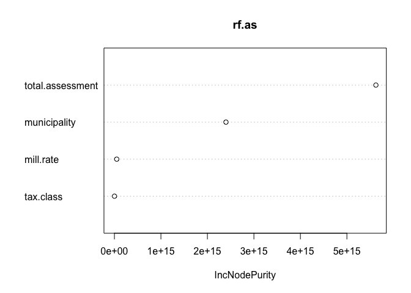
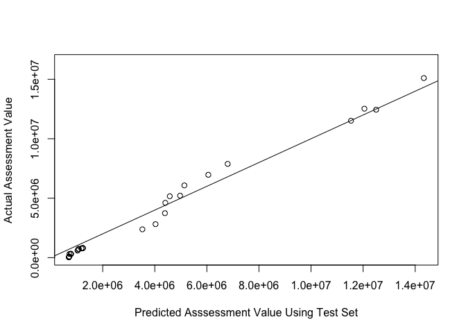

random forest and lme
================

``` r
suppressPackageStartupMessages(library(randomForest))
suppressPackageStartupMessages(library(tidyverse))
suppressPackageStartupMessages(library(nlme))
suppressPackageStartupMessages(library(ROCR))
```

``` r
dat <- readr::read_delim("test_train_data.txt", delim = ",", col_types = "ciccdddddc")
dat$municipality <- as.factor(dat$municipality)

factors_tbl = dat %>% 
  group_by(municipality) %>% 
  count(name="mun_count", sort = TRUE) %>% 
  ungroup() %>% 
  mutate(perc = mun_count/sum(mun_count),
         cum_perc = cumsum(perc)) %>% 
  arrange(desc(mun_count)) %>% 
  mutate(rank = row_number(),
         municipality = fct_reorder(municipality, rank)) %>% 
  mutate(col_municipality = fct_collapse(municipality, other = levels(municipality)[-c(1:52)])) %>% 
  select(municipality, col_municipality)

dat <- dat %>% 
  left_join(factors_tbl) %>% 
  select(-c(municipality)) %>% 
  rename(municipality = col_municipality) %>% 
  group_by(PIC) %>% 
  mutate(next.assess = lead(total.assessment, order_by = year),
         past.mill = lag(mill.rate, order_by = year)) %>%
  arrange(PIC) %>% 
  group_by(municipality, year) %>% 
  mutate(n.prop = n()) %>% 
  arrange(desc(n.prop)) %>% 
  distinct(municipality, .keep_all = T) 
```

    ## Joining, by = "municipality"

    ## Warning: Column `municipality` joining factors with different levels, coercing
    ## to character vector

``` r
train <- dat %>%  filter(test.train == "train") 
test <- dat %>%  filter(test.train == "test")
```

# Random Forest

``` r
set.seed(0)

rf.mill <- randomForest(
  mill.rate ~  tax.class + municipality + total.assessment + past.mill,na.action = na.omit, mtry = 4,
  data=train, ntree=500
)
#Evaluate variable importance
importance(rf.mill)
```

    ##                  IncNodePurity
    ## tax.class           3652.93960
    ## municipality        1514.35514
    ## total.assessment      27.34116
    ## past.mill            201.70582

``` r
varImpPlot(rf.mill)
```

<!-- -->

``` r
rf.as <- randomForest(
  next.assess ~  tax.class + municipality + total.assessment + mill.rate,na.action = na.omit,mtry = 4,
  data=train
)

importance(rf.as)
```

    ##                  IncNodePurity
    ## tax.class         1.511095e+12
    ## municipality      2.398779e+15
    ## total.assessment  5.623527e+15
    ## mill.rate         4.940560e+13

``` r
varImpPlot(rf.as)
```

<!-- -->

``` r
yhat.bag <- predict(rf.mill,newdata=test)
plot(yhat.bag, test$mill.rate, xlab="Predicted Mill Rate Using Test Set", ylab="Actual Mill Rate")
abline(0,1)
```

<!-- -->

``` r
yhat.bag1 <- predict(rf.as,newdata=test)
plot(yhat.bag1, test$next.assess, xlab="Predicted Asssessment Value Using Test Set", ylab="Actual Assessment Value")
abline(0,1)
```

<!-- -->

# Linear Mixed Effect Model

``` r
# both random slope and random intercept
# different rate of change of assessment value and mill rate as well as initial assessment value and mill rate for each municipality 
lme.mill <- lme( mill.rate ~  tax.class + municipality + total.assessment + past.mill,na.action = na.omit, data=train, random = ~ 1 + total.assessment + past.mill | municipality, method = "ML")

summary(lme.mill)
```

    ## Warning in pt(-abs(tVal), fDF): NaNs produced

    ## Linear mixed-effects model fit by maximum likelihood
    ##  Data: train 
    ##        AIC      BIC    logLik
    ##   293.3333 390.3806 -108.6666
    ## 
    ## Random effects:
    ##  Formula: ~1 + total.assessment + past.mill | municipality
    ##  Structure: General positive-definite, Log-Cholesky parametrization
    ##                  StdDev       Corr         
    ## (Intercept)      1.450311e+00 (Intr) ttl.ss
    ## total.assessment 5.257258e-09  0.810       
    ## past.mill        8.739103e-02 -0.996 -0.816
    ## Residual         6.356604e-01              
    ## 
    ## Fixed effects: mill.rate ~ tax.class + municipality + total.assessment + past.mill 
    ##                                               Value Std.Error DF   t-value
    ## (Intercept)                                4.933947  2.198510 64  2.244223
    ## tax.class06                               10.521449  0.848403 64 12.401469
    ## municipalityWest Vancouver                -2.005994  2.423122  0 -0.827855
    ## municipalityNorthern Rockies Regional Mun -0.502322  2.234576  0 -0.224795
    ## municipalityDawson Creek Rural            -4.897907  2.528534  0 -1.937054
    ## municipalityChilliwack                    -6.554064  2.204834  0 -2.972588
    ## municipalityDelta                         -1.276921  2.458221  0 -0.519449
    ## municipalityLangley - Township            -4.602148  2.075459  0 -2.217412
    ## municipalityVernon                        -2.693014  2.048992  0 -1.314312
    ## municipalityPrince George                  2.788351  2.370987  0  1.176030
    ## municipalityKamloops                      -0.686938  2.220503  0 -0.309361
    ## municipalityCoquitlam                     -2.703277  1.958959  0 -1.379955
    ## municipalityPenticton                     -5.966158  2.182057  0 -2.734190
    ## municipalityMaple Ridge                   -1.323835  2.423070  0 -0.546346
    ## municipalityNew Westminster               -1.085314  1.991131  0 -0.545074
    ## municipalityFort St John                   1.670242  2.203046  0  0.758151
    ## municipalityPort Coquitlam                -3.856531  2.019028  0 -1.910093
    ## municipalitySaanich (Sd61)                 2.866452  2.556845  0  1.121089
    ## municipalityParksville                    -1.917786  2.170890  0 -0.883410
    ## municipalityCourtenay                     -1.316847  2.220577  0 -0.593020
    ## municipalityNelson Rural                  -1.176320  2.226696  0 -0.528280
    ## municipalityDawson Creek                   3.141820  2.405807  0  1.305932
    ## municipalitySalmon Arm Rural              -3.069393  2.059491  0 -1.490365
    ## municipalityLangley - City                 0.337683  2.561003  0  0.131856
    ## municipalityCranbrook                      2.690711  2.399814  0  1.121217
    ## municipalityRevelstoke                     1.695812  2.019817  0  0.839587
    ## municipalityLangford                      -2.810841  1.907775  0 -1.473361
    ## municipalitySalmon Arm                    -1.042623  2.180500  0 -0.478158
    ## municipalityother                         10.174827  4.471177  0  2.275649
    ## total.assessment                           0.000000  0.000000 64 -2.206111
    ## past.mill                                  0.244975  0.061545 64  3.980397
    ##                                           p-value
    ## (Intercept)                                0.0283
    ## tax.class06                                0.0000
    ## municipalityWest Vancouver                    NaN
    ## municipalityNorthern Rockies Regional Mun     NaN
    ## municipalityDawson Creek Rural                NaN
    ## municipalityChilliwack                        NaN
    ## municipalityDelta                             NaN
    ## municipalityLangley - Township                NaN
    ## municipalityVernon                            NaN
    ## municipalityPrince George                     NaN
    ## municipalityKamloops                          NaN
    ## municipalityCoquitlam                         NaN
    ## municipalityPenticton                         NaN
    ## municipalityMaple Ridge                       NaN
    ## municipalityNew Westminster                   NaN
    ## municipalityFort St John                      NaN
    ## municipalityPort Coquitlam                    NaN
    ## municipalitySaanich (Sd61)                    NaN
    ## municipalityParksville                        NaN
    ## municipalityCourtenay                         NaN
    ## municipalityNelson Rural                      NaN
    ## municipalityDawson Creek                      NaN
    ## municipalitySalmon Arm Rural                  NaN
    ## municipalityLangley - City                    NaN
    ## municipalityCranbrook                         NaN
    ## municipalityRevelstoke                        NaN
    ## municipalityLangford                          NaN
    ## municipalitySalmon Arm                        NaN
    ## municipalityother                             NaN
    ## total.assessment                           0.0310
    ## past.mill                                  0.0002
    ##  Correlation: 
    ##                                           (Intr) tx.c06 mncpWV mnNRRM mncDCR
    ## tax.class06                                0.045                            
    ## municipalityWest Vancouver                -0.736 -0.019                     
    ## municipalityNorthern Rockies Regional Mun -0.778 -0.330  0.626              
    ## municipalityDawson Creek Rural            -0.598  0.072  0.511  0.730       
    ## municipalityChilliwack                    -0.819 -0.365  0.646  0.905  0.661
    ## municipalityDelta                         -0.820 -0.019  0.622  0.690  0.561
    ## municipalityLangley - Township            -0.872  0.028  0.691  0.859  0.767
    ## municipalityVernon                        -0.859 -0.063  0.688  0.908  0.788
    ## municipalityPrince George                 -0.663 -0.290  0.555  0.881  0.715
    ## municipalityKamloops                      -0.767 -0.331  0.622  0.937  0.730
    ## municipalityCoquitlam                     -0.549 -0.368  0.528  0.833  0.660
    ## municipalityPenticton                     -0.836 -0.368  0.657  0.922  0.675
    ## municipalityMaple Ridge                   -0.823 -0.011  0.627  0.712  0.589
    ## municipalityNew Westminster               -0.461 -0.354  0.478  0.779  0.629
    ## municipalityFort St John                  -0.668 -0.318  0.572  0.901  0.725
    ## municipalityPort Coquitlam                -0.843  0.030  0.681  0.845  0.761
    ## municipalitySaanich (Sd61)                -0.806 -0.346  0.606  0.783  0.528
    ## municipalityParksville                    -0.773 -0.342  0.629  0.941  0.729
    ## municipalityCourtenay                     -0.778 -0.333  0.627  0.940  0.729
    ## municipalityNelson Rural                  -0.786 -0.335  0.631  0.939  0.725
    ## municipalityDawson Creek                  -0.663 -0.285  0.553  0.878  0.713
    ## municipalitySalmon Arm Rural              -0.863  0.036  0.689  0.870  0.786
    ## municipalityLangley - City                -0.019 -0.255  0.187  0.392  0.351
    ## municipalityCranbrook                     -0.670 -0.287  0.557  0.881  0.713
    ## municipalityRevelstoke                    -0.840 -0.151  0.680  0.920  0.769
    ## municipalityLangford                      -0.808  0.042  0.676  0.852  0.786
    ## municipalitySalmon Arm                    -0.801 -0.346  0.642  0.947  0.725
    ## municipalityother                          0.339 -0.111 -0.080  0.038  0.105
    ## total.assessment                          -0.675 -0.050  0.365  0.400  0.241
    ## past.mill                                 -0.401 -0.170  0.189 -0.092 -0.311
    ##                                           mncpltyCh mncplD mncL-T mncplV mncpPG
    ## tax.class06                                                                    
    ## municipalityWest Vancouver                                                     
    ## municipalityNorthern Rockies Regional Mun                                      
    ## municipalityDawson Creek Rural                                                 
    ## municipalityChilliwack                                                         
    ## municipalityDelta                          0.707                               
    ## municipalityLangley - Township             0.831     0.763                     
    ## municipalityVernon                         0.873     0.759  0.936              
    ## municipalityPrince George                  0.830     0.606  0.795  0.848       
    ## municipalityKamloops                       0.902     0.683  0.854  0.904  0.881
    ## municipalityCoquitlam                      0.794     0.525  0.706  0.771  0.819
    ## municipalityPenticton                      0.916     0.721  0.848  0.891  0.844
    ## municipalityMaple Ridge                    0.721     0.695  0.784  0.782  0.632
    ## municipalityNew Westminster                0.733     0.459  0.645  0.712  0.780
    ## municipalityFort St John                   0.852     0.614  0.805  0.861  0.867
    ## municipalityPort Coquitlam                 0.817     0.743  0.910  0.920  0.787
    ## municipalitySaanich (Sd61)                 0.807     0.671  0.734  0.761  0.691
    ## municipalityParksville                     0.908     0.687  0.856  0.906  0.884
    ## municipalityCourtenay                      0.906     0.690  0.858  0.908  0.881
    ## municipalityNelson Rural                   0.908     0.694  0.859  0.908  0.878
    ## municipalityDawson Creek                   0.826     0.606  0.794  0.846  0.841
    ## municipalitySalmon Arm Rural               0.835     0.760  0.936  0.947  0.810
    ## municipalityLangley - City                 0.345     0.101  0.251  0.314  0.450
    ## municipalityCranbrook                      0.830     0.611  0.797  0.849  0.843
    ## municipalityRevelstoke                     0.890     0.743  0.914  0.944  0.860
    ## municipalityLangford                       0.815     0.726  0.911  0.926  0.807
    ## municipalitySalmon Arm                     0.920     0.705  0.866  0.914  0.884
    ## municipalityother                         -0.015    -0.199 -0.084 -0.032  0.136
    ## total.assessment                           0.433     0.504  0.475  0.450  0.282
    ## past.mill                                  0.067     0.222 -0.026 -0.074 -0.220
    ##                                           mncplK mncpltyCq mncpltyPn mncpMR
    ## tax.class06                                                                
    ## municipalityWest Vancouver                                                 
    ## municipalityNorthern Rockies Regional Mun                                  
    ## municipalityDawson Creek Rural                                             
    ## municipalityChilliwack                                                     
    ## municipalityDelta                                                          
    ## municipalityLangley - Township                                             
    ## municipalityVernon                                                         
    ## municipalityPrince George                                                  
    ## municipalityKamloops                                                       
    ## municipalityCoquitlam                      0.841                           
    ## municipalityPenticton                      0.918  0.803                    
    ## municipalityMaple Ridge                    0.705  0.547     0.736          
    ## municipalityNew Westminster                0.789  0.945     0.741     0.481
    ## municipalityFort St John                   0.903  0.870     0.867     0.639
    ## municipalityPort Coquitlam                 0.842  0.725     0.832     0.764
    ## municipalitySaanich (Sd61)                 0.777  0.634     0.823     0.677
    ## municipalityParksville                     0.940  0.853     0.925     0.709
    ## municipalityCourtenay                      0.937  0.837     0.923     0.712
    ## municipalityNelson Rural                   0.936  0.831     0.925     0.716
    ## municipalityDawson Creek                   0.878  0.809     0.841     0.631
    ## municipalitySalmon Arm Rural               0.866  0.723     0.852     0.783
    ## municipalityLangley - City                 0.410  0.753     0.342     0.117
    ## municipalityCranbrook                      0.881  0.809     0.846     0.636
    ## municipalityRevelstoke                     0.917  0.810     0.906     0.764
    ## municipalityLangford                       0.851  0.780     0.829     0.749
    ## municipalitySalmon Arm                     0.944  0.840     0.937     0.726
    ## municipalityother                          0.059  0.476    -0.026    -0.187
    ## total.assessment                           0.379 -0.055     0.451     0.503
    ## past.mill                                 -0.107 -0.279     0.069     0.182
    ##                                           mncpNW mncFSJ mncpPC mS(S61 mncpltyPr
    ## tax.class06                                                                    
    ## municipalityWest Vancouver                                                     
    ## municipalityNorthern Rockies Regional Mun                                      
    ## municipalityDawson Creek Rural                                                 
    ## municipalityChilliwack                                                         
    ## municipalityDelta                                                              
    ## municipalityLangley - Township                                                 
    ## municipalityVernon                                                             
    ## municipalityPrince George                                                      
    ## municipalityKamloops                                                           
    ## municipalityCoquitlam                                                          
    ## municipalityPenticton                                                          
    ## municipalityMaple Ridge                                                        
    ## municipalityNew Westminster                                                    
    ## municipalityFort St John                   0.836                               
    ## municipalityPort Coquitlam                 0.671  0.802                        
    ## municipalitySaanich (Sd61)                 0.565  0.707  0.714                 
    ## municipalityParksville                     0.802  0.908  0.844  0.784          
    ## municipalityCourtenay                      0.783  0.902  0.845  0.784  0.942   
    ## municipalityNelson Rural                   0.775  0.899  0.845  0.789  0.941   
    ## municipalityDawson Creek                   0.769  0.862  0.785  0.689  0.880   
    ## municipalitySalmon Arm Rural               0.663  0.821  0.920  0.730  0.867   
    ## municipalityLangley - City                 0.818  0.519  0.305  0.182  0.427   
    ## municipalityCranbrook                      0.768  0.863  0.788  0.694  0.883   
    ## municipalityRevelstoke                     0.755  0.879  0.902  0.774  0.921   
    ## municipalityLangford                       0.737  0.828  0.906  0.694  0.855   
    ## municipalitySalmon Arm                     0.784  0.905  0.852  0.803  0.949   
    ## municipalityother                          0.572  0.200 -0.019 -0.156  0.074   
    ## total.assessment                          -0.170  0.232  0.408  0.507  0.368   
    ## past.mill                                 -0.347 -0.227 -0.052  0.253 -0.096   
    ##                                           mncpltyCrt mncpNR mncpDC mncSAR
    ## tax.class06                                                              
    ## municipalityWest Vancouver                                               
    ## municipalityNorthern Rockies Regional Mun                                
    ## municipalityDawson Creek Rural                                           
    ## municipalityChilliwack                                                   
    ## municipalityDelta                                                        
    ## municipalityLangley - Township                                           
    ## municipalityVernon                                                       
    ## municipalityPrince George                                                
    ## municipalityKamloops                                                     
    ## municipalityCoquitlam                                                    
    ## municipalityPenticton                                                    
    ## municipalityMaple Ridge                                                  
    ## municipalityNew Westminster                                              
    ## municipalityFort St John                                                 
    ## municipalityPort Coquitlam                                               
    ## municipalitySaanich (Sd61)                                               
    ## municipalityParksville                                                   
    ## municipalityCourtenay                                                    
    ## municipalityNelson Rural                   0.939                         
    ## municipalityDawson Creek                   0.878      0.875              
    ## municipalitySalmon Arm Rural               0.869      0.869  0.809       
    ## municipalityLangley - City                 0.398      0.386  0.435  0.272
    ## municipalityCranbrook                      0.881      0.878  0.839  0.812
    ## municipalityRevelstoke                     0.920      0.920  0.857  0.925
    ## municipalityLangford                       0.852      0.851  0.803  0.924
    ## municipalitySalmon Arm                     0.948      0.947  0.880  0.875
    ## municipalityother                          0.044      0.030  0.121 -0.061
    ## total.assessment                           0.394      0.407  0.294  0.459
    ## past.mill                                 -0.090     -0.074 -0.216 -0.066
    ##                                           mncL-C mncpltyCrn mncplR mncplL
    ## tax.class06                                                              
    ## municipalityWest Vancouver                                               
    ## municipalityNorthern Rockies Regional Mun                                
    ## municipalityDawson Creek Rural                                           
    ## municipalityChilliwack                                                   
    ## municipalityDelta                                                        
    ## municipalityLangley - Township                                           
    ## municipalityVernon                                                       
    ## municipalityPrince George                                                
    ## municipalityKamloops                                                     
    ## municipalityCoquitlam                                                    
    ## municipalityPenticton                                                    
    ## municipalityMaple Ridge                                                  
    ## municipalityNew Westminster                                              
    ## municipalityFort St John                                                 
    ## municipalityPort Coquitlam                                               
    ## municipalitySaanich (Sd61)                                               
    ## municipalityParksville                                                   
    ## municipalityCourtenay                                                    
    ## municipalityNelson Rural                                                 
    ## municipalityDawson Creek                                                 
    ## municipalitySalmon Arm Rural                                             
    ## municipalityLangley - City                                               
    ## municipalityCranbrook                      0.430                         
    ## municipalityRevelstoke                     0.371  0.860                  
    ## municipalityLangford                       0.406  0.806      0.911       
    ## municipalitySalmon Arm                     0.392  0.884      0.928  0.858
    ## municipalityother                          0.884  0.114      0.021  0.092
    ## total.assessment                          -0.638  0.302      0.406  0.309
    ## past.mill                                 -0.498 -0.208     -0.069 -0.135
    ##                                           mncpSA mncplt ttl.ss
    ## tax.class06                                                   
    ## municipalityWest Vancouver                                    
    ## municipalityNorthern Rockies Regional Mun                     
    ## municipalityDawson Creek Rural                                
    ## municipalityChilliwack                                        
    ## municipalityDelta                                             
    ## municipalityLangley - Township                                
    ## municipalityVernon                                            
    ## municipalityPrince George                                     
    ## municipalityKamloops                                          
    ## municipalityCoquitlam                                         
    ## municipalityPenticton                                         
    ## municipalityMaple Ridge                                       
    ## municipalityNew Westminster                                   
    ## municipalityFort St John                                      
    ## municipalityPort Coquitlam                                    
    ## municipalitySaanich (Sd61)                                    
    ## municipalityParksville                                        
    ## municipalityCourtenay                                         
    ## municipalityNelson Rural                                      
    ## municipalityDawson Creek                                      
    ## municipalitySalmon Arm Rural                                  
    ## municipalityLangley - City                                    
    ## municipalityCranbrook                                         
    ## municipalityRevelstoke                                        
    ## municipalityLangford                                          
    ## municipalitySalmon Arm                                        
    ## municipalityother                          0.031              
    ## total.assessment                           0.410 -0.879       
    ## past.mill                                 -0.054 -0.593  0.508
    ## 
    ## Standardized Within-Group Residuals:
    ##         Min          Q1         Med          Q3         Max 
    ## -3.31088926 -0.36926579 -0.04108855  0.28880753  5.02306619 
    ## 
    ## Number of Observations: 95
    ## Number of Groups: 28

``` r
lme.as <- lme(next.assess ~  tax.class + municipality + total.assessment + mill.rate ,na.action = na.omit, data=train, random = ~ 1 + total.assessment + mill.rate | municipality, method = "ML")

summary(lme.as)
```

    ## Warning in pt(-abs(tVal), fDF): NaNs produced

    ## Linear mixed-effects model fit by maximum likelihood
    ##  Data: train 
    ##        AIC      BIC    logLik
    ##   3142.553 3242.673 -1533.277
    ## 
    ## Random effects:
    ##  Formula: ~1 + total.assessment + mill.rate | municipality
    ##  Structure: General positive-definite, Log-Cholesky parametrization
    ##                  StdDev       Corr         
    ## (Intercept)      3.425367e+04 (Intr) ttl.ss
    ## total.assessment 2.622231e-03 -0.088       
    ## mill.rate        2.496402e+03 -0.374  0.045
    ## Residual         7.040724e+05              
    ## 
    ## Fixed effects: next.assess ~ tax.class + municipality + total.assessment + mill.rate 
    ##                                               Value Std.Error DF   t-value
    ## (Intercept)                                 8774571 1111186.4 72  7.896579
    ## tax.class06                                   57637 1257141.7 72  0.045847
    ## municipalityWest Vancouver                 -6229593  789839.2  0 -7.887167
    ## municipalityNorthern Rockies Regional Mun  -7369795 1029535.4  0 -7.158369
    ## municipalityDawson Creek Rural             -8120324 1180222.6  0 -6.880333
    ## municipalityChilliwack                     -7190761 1343546.5  0 -5.352074
    ## municipalityDelta                          -7843992  948670.8  0 -8.268402
    ## municipalityLangley - Township             -8415085 1024647.7  0 -8.212661
    ## municipalityVernon                         -7998719  917755.8  0 -8.715521
    ## municipalityPrince George                  -6597861  990535.5  0 -6.660903
    ## municipalityKamloops                       -7102156 1005168.4  0 -7.065637
    ## municipalityCoquitlam                       -576301  823648.2  0 -0.699694
    ## municipalityPenticton                      -7178278 1235110.1  0 -5.811853
    ## municipalityMaple Ridge                    -8012215 1197040.7  0 -6.693352
    ## municipalityNew Westminster                  -48964  803671.5  0 -0.060926
    ## municipalityFort St John                   -5592483  838240.2  0 -6.671695
    ## municipalityPort Coquitlam                 -6384150  851610.6  0 -7.496559
    ## municipalitySaanich (Sd61)                 -7198447 1000909.7  0 -7.191905
    ## municipalityParksville                     -6769184 1036316.6  0 -6.531966
    ## municipalityCourtenay                      -7201617 1018700.9  0 -7.069413
    ## municipalityNelson Rural                   -7351507 1042707.1  0 -7.050405
    ## municipalityDawson Creek                   -6850789 1005244.5  0 -6.815048
    ## municipalitySalmon Arm Rural               -8232387  948681.7  0 -8.677713
    ## municipalityLangley - City                  8092892 1208901.9  0  6.694416
    ## municipalityCranbrook                      -6877062 1008704.1  0 -6.817720
    ## municipalityRevelstoke                     -6631951  880977.2  0 -7.527948
    ## municipalityLangford                       -6008340  716430.8  0 -8.386491
    ## municipalitySalmon Arm                     -7124562 1039642.1  0 -6.852899
    ## municipalityother                         -12812445 2974855.7  0 -4.306913
    ## total.assessment                                  1       0.1 72 10.596408
    ## mill.rate                                    -71211   82284.4 72 -0.865422
    ##                                           p-value
    ## (Intercept)                                0.0000
    ## tax.class06                                0.9636
    ## municipalityWest Vancouver                    NaN
    ## municipalityNorthern Rockies Regional Mun     NaN
    ## municipalityDawson Creek Rural                NaN
    ## municipalityChilliwack                        NaN
    ## municipalityDelta                             NaN
    ## municipalityLangley - Township                NaN
    ## municipalityVernon                            NaN
    ## municipalityPrince George                     NaN
    ## municipalityKamloops                          NaN
    ## municipalityCoquitlam                         NaN
    ## municipalityPenticton                         NaN
    ## municipalityMaple Ridge                       NaN
    ## municipalityNew Westminster                   NaN
    ## municipalityFort St John                      NaN
    ## municipalityPort Coquitlam                    NaN
    ## municipalitySaanich (Sd61)                    NaN
    ## municipalityParksville                        NaN
    ## municipalityCourtenay                         NaN
    ## municipalityNelson Rural                      NaN
    ## municipalityDawson Creek                      NaN
    ## municipalitySalmon Arm Rural                  NaN
    ## municipalityLangley - City                    NaN
    ## municipalityCranbrook                         NaN
    ## municipalityRevelstoke                        NaN
    ## municipalityLangford                          NaN
    ## municipalitySalmon Arm                        NaN
    ## municipalityother                             NaN
    ## total.assessment                           0.0000
    ## mill.rate                                  0.3897
    ##  Correlation: 
    ##                                           (Intr) tx.c06 mncpWV mnNRRM mncDCR
    ## tax.class06                                0.561                            
    ## municipalityWest Vancouver                -0.800 -0.323                     
    ## municipalityNorthern Rockies Regional Mun -0.685 -0.383  0.616              
    ## municipalityDawson Creek Rural            -0.615 -0.107  0.556  0.524       
    ## municipalityChilliwack                    -0.790 -0.710  0.620  0.704  0.439
    ## municipalityDelta                         -0.854 -0.290  0.739  0.669  0.614
    ## municipalityLangley - Township            -0.839 -0.284  0.721  0.656  0.604
    ## municipalityVernon                        -0.826 -0.251  0.734  0.738  0.630
    ## municipalityPrince George                 -0.403 -0.025  0.450  0.738  0.450
    ## municipalityKamloops                      -0.655 -0.352  0.599  0.824  0.515
    ## municipalityCoquitlam                     -0.395 -0.466  0.405  0.638  0.266
    ## municipalityPenticton                     -0.829 -0.713  0.659  0.762  0.479
    ## municipalityMaple Ridge                   -0.661 -0.187  0.580  0.533  0.493
    ## municipalityNew Westminster               -0.154 -0.287  0.245  0.509  0.144
    ## municipalityFort St John                  -0.441 -0.064  0.488  0.720  0.455
    ## municipalityPort Coquitlam                -0.807 -0.240  0.722  0.651  0.599
    ## municipalitySaanich (Sd61)                -0.694 -0.400  0.624  0.842  0.528
    ## municipalityParksville                    -0.676 -0.432  0.600  0.800  0.494
    ## municipalityCourtenay                     -0.673 -0.371  0.609  0.828  0.521
    ## municipalityNelson Rural                  -0.713 -0.432  0.629  0.830  0.525
    ## municipalityDawson Creek                  -0.407 -0.016  0.453  0.740  0.456
    ## municipalitySalmon Arm Rural              -0.815 -0.193  0.723  0.673  0.625
    ## municipalityLangley - City                 0.511  0.037 -0.290 -0.110 -0.327
    ## municipalityCranbrook                     -0.416 -0.022  0.458  0.744  0.460
    ## municipalityRevelstoke                    -0.510  0.044  0.543  0.704  0.529
    ## municipalityLangford                      -0.701 -0.092  0.681  0.624  0.578
    ## municipalitySalmon Arm                    -0.722 -0.463  0.632  0.827  0.519
    ## municipalityother                          0.798  0.414 -0.527 -0.405 -0.458
    ## total.assessment                          -0.910 -0.482  0.650  0.608  0.561
    ## mill.rate                                 -0.673 -0.904  0.400  0.234  0.166
    ##                                           mncpltyCh mncplD mncL-T mncplV mncpPG
    ## tax.class06                                                                    
    ## municipalityWest Vancouver                                                     
    ## municipalityNorthern Rockies Regional Mun                                      
    ## municipalityDawson Creek Rural                                                 
    ## municipalityChilliwack                                                         
    ## municipalityDelta                          0.639                               
    ## municipalityLangley - Township             0.626     0.787                     
    ## municipalityVernon                         0.648     0.804  0.789              
    ## municipalityPrince George                  0.450     0.507  0.497  0.616       
    ## municipalityKamloops                       0.682     0.651  0.638  0.725  0.750
    ## municipalityCoquitlam                      0.586     0.366  0.348  0.430  0.566
    ## municipalityPenticton                      0.840     0.685  0.671  0.701  0.512
    ## municipalityMaple Ridge                    0.487     0.634  0.623  0.641  0.423
    ## municipalityNew Westminster                0.398     0.184  0.166  0.263  0.530
    ## municipalityFort St John                   0.470     0.527  0.513  0.622  0.770
    ## municipalityPort Coquitlam                 0.602     0.774  0.757  0.780  0.516
    ## municipalitySaanich (Sd61)                 0.719     0.675  0.662  0.746  0.747
    ## municipalityParksville                     0.708     0.642  0.628  0.703  0.690
    ## municipalityCourtenay                      0.695     0.661  0.648  0.733  0.743
    ## municipalityNelson Rural                   0.730     0.679  0.666  0.742  0.716
    ## municipalityDawson Creek                   0.448     0.513  0.503  0.622  0.817
    ## municipalitySalmon Arm Rural               0.592     0.795  0.781  0.809  0.552
    ## municipalityLangley - City                -0.175    -0.430 -0.442 -0.378  0.043
    ## municipalityCranbrook                      0.454     0.520  0.509  0.628  0.817
    ## municipalityRevelstoke                     0.436     0.609  0.597  0.693  0.757
    ## municipalityLangford                       0.508     0.721  0.703  0.742  0.559
    ## municipalitySalmon Arm                     0.744     0.678  0.665  0.738  0.701
    ## municipalityother                         -0.536    -0.643 -0.647 -0.597 -0.139
    ## total.assessment                           0.686     0.768  0.767  0.748  0.346
    ## mill.rate                                  0.634     0.378  0.371  0.285 -0.173
    ##                                           mncplK mncpltyCq mncpltyPn mncpMR
    ## tax.class06                                                                
    ## municipalityWest Vancouver                                                 
    ## municipalityNorthern Rockies Regional Mun                                  
    ## municipalityDawson Creek Rural                                             
    ## municipalityChilliwack                                                     
    ## municipalityDelta                                                          
    ## municipalityLangley - Township                                             
    ## municipalityVernon                                                         
    ## municipalityPrince George                                                  
    ## municipalityKamloops                                                       
    ## municipalityCoquitlam                      0.641                           
    ## municipalityPenticton                      0.741  0.624                    
    ## municipalityMaple Ridge                    0.520  0.281     0.525          
    ## municipalityNew Westminster                0.523  0.690     0.431     0.143
    ## municipalityFort St John                   0.730  0.577     0.529     0.435
    ## municipalityPort Coquitlam                 0.637  0.376     0.648     0.613
    ## municipalitySaanich (Sd61)                 0.837  0.655     0.778     0.538
    ## municipalityParksville                     0.793  0.640     0.763     0.508
    ## municipalityCourtenay                      0.823  0.639     0.754     0.528
    ## municipalityNelson Rural                   0.823  0.642     0.787     0.539
    ## municipalityDawson Creek                   0.751  0.558     0.510     0.429
    ## municipalitySalmon Arm Rural               0.658  0.346     0.641     0.635
    ## municipalityLangley - City                -0.081  0.342    -0.186    -0.343
    ## municipalityCranbrook                      0.755  0.558     0.517     0.434
    ## municipalityRevelstoke                     0.711  0.459     0.496     0.505
    ## municipalityLangford                       0.617  0.384     0.555     0.578
    ## municipalitySalmon Arm                     0.818  0.650     0.800     0.536
    ## municipalityother                         -0.369  0.001    -0.559    -0.499
    ## total.assessment                           0.575  0.194     0.724     0.600
    ## mill.rate                                  0.193  0.224     0.626     0.253
    ##                                           mncpNW mncFSJ mncpPC mS(S61 mncpltyPr
    ## tax.class06                                                                    
    ## municipalityWest Vancouver                                                     
    ## municipalityNorthern Rockies Regional Mun                                      
    ## municipalityDawson Creek Rural                                                 
    ## municipalityChilliwack                                                         
    ## municipalityDelta                                                              
    ## municipalityLangley - Township                                                 
    ## municipalityVernon                                                             
    ## municipalityPrince George                                                      
    ## municipalityKamloops                                                           
    ## municipalityCoquitlam                                                          
    ## municipalityPenticton                                                          
    ## municipalityMaple Ridge                                                        
    ## municipalityNew Westminster                                                    
    ## municipalityFort St John                   0.536                               
    ## municipalityPort Coquitlam                 0.214  0.538                        
    ## municipalitySaanich (Sd61)                 0.525  0.730  0.658                 
    ## municipalityParksville                     0.511  0.678  0.624  0.813          
    ## municipalityCourtenay                      0.515  0.724  0.645  0.840  0.797   
    ## municipalityNelson Rural                   0.503  0.702  0.659  0.843  0.804   
    ## municipalityDawson Creek                   0.521  0.771  0.521  0.748  0.690   
    ## municipalitySalmon Arm Rural               0.179  0.562  0.771  0.678  0.637   
    ## municipalityLangley - City                 0.529  0.065 -0.365 -0.100 -0.081   
    ## municipalityCranbrook                      0.518  0.772  0.527  0.752  0.694   
    ## municipalityRevelstoke                     0.397  0.728  0.614  0.709  0.651   
    ## municipalityLangford                       0.267  0.580  0.717  0.630  0.591   
    ## municipalitySalmon Arm                     0.507  0.690  0.657  0.840  0.804   
    ## municipalityother                          0.247 -0.137 -0.570 -0.404 -0.389   
    ## total.assessment                          -0.062  0.338  0.699  0.611  0.585   
    ## mill.rate                                  0.005 -0.106  0.319  0.245  0.284   
    ##                                           mncpltyCrt mncpNR mncpDC mncSAR
    ## tax.class06                                                              
    ## municipalityWest Vancouver                                               
    ## municipalityNorthern Rockies Regional Mun                                
    ## municipalityDawson Creek Rural                                           
    ## municipalityChilliwack                                                   
    ## municipalityDelta                                                        
    ## municipalityLangley - Township                                           
    ## municipalityVernon                                                       
    ## municipalityPrince George                                                
    ## municipalityKamloops                                                     
    ## municipalityCoquitlam                                                    
    ## municipalityPenticton                                                    
    ## municipalityMaple Ridge                                                  
    ## municipalityNew Westminster                                              
    ## municipalityFort St John                                                 
    ## municipalityPort Coquitlam                                               
    ## municipalitySaanich (Sd61)                                               
    ## municipalityParksville                                                   
    ## municipalityCourtenay                                                    
    ## municipalityNelson Rural                   0.827                         
    ## municipalityDawson Creek                   0.744      0.717              
    ## municipalitySalmon Arm Rural               0.667      0.677  0.559       
    ## municipalityLangley - City                -0.098     -0.123  0.028 -0.432
    ## municipalityCranbrook                      0.748      0.722  0.820  0.565
    ## municipalityRevelstoke                     0.706      0.684  0.762  0.655
    ## municipalityLangford                       0.621      0.622  0.563  0.733
    ## municipalitySalmon Arm                     0.824      0.833  0.701  0.671
    ## municipalityother                         -0.390     -0.432 -0.149 -0.615
    ## total.assessment                           0.594      0.632  0.355  0.744
    ## mill.rate                                  0.218      0.290 -0.178  0.274
    ##                                           mncL-C mncpltyCrn mncplR mncplL
    ## tax.class06                                                              
    ## municipalityWest Vancouver                                               
    ## municipalityNorthern Rockies Regional Mun                                
    ## municipalityDawson Creek Rural                                           
    ## municipalityChilliwack                                                   
    ## municipalityDelta                                                        
    ## municipalityLangley - Township                                           
    ## municipalityVernon                                                       
    ## municipalityPrince George                                                
    ## municipalityKamloops                                                     
    ## municipalityCoquitlam                                                    
    ## municipalityPenticton                                                    
    ## municipalityMaple Ridge                                                  
    ## municipalityNew Westminster                                              
    ## municipalityFort St John                                                 
    ## municipalityPort Coquitlam                                               
    ## municipalitySaanich (Sd61)                                               
    ## municipalityParksville                                                   
    ## municipalityCourtenay                                                    
    ## municipalityNelson Rural                                                 
    ## municipalityDawson Creek                                                 
    ## municipalitySalmon Arm Rural                                             
    ## municipalityLangley - City                                               
    ## municipalityCranbrook                      0.020                         
    ## municipalityRevelstoke                    -0.118  0.764                  
    ## municipalityLangford                      -0.248  0.567      0.651       
    ## municipalitySalmon Arm                    -0.117  0.705      0.667  0.616
    ## municipalityother                          0.805 -0.159     -0.264 -0.423
    ## total.assessment                          -0.741  0.365      0.444  0.561
    ## mill.rate                                 -0.302 -0.170     -0.132  0.151
    ##                                           mncpSA mncplt ttl.ss
    ## tax.class06                                                   
    ## municipalityWest Vancouver                                    
    ## municipalityNorthern Rockies Regional Mun                     
    ## municipalityDawson Creek Rural                                
    ## municipalityChilliwack                                        
    ## municipalityDelta                                             
    ## municipalityLangley - Township                                
    ## municipalityVernon                                            
    ## municipalityPrince George                                     
    ## municipalityKamloops                                          
    ## municipalityCoquitlam                                         
    ## municipalityPenticton                                         
    ## municipalityMaple Ridge                                       
    ## municipalityNew Westminster                                   
    ## municipalityFort St John                                      
    ## municipalityPort Coquitlam                                    
    ## municipalitySaanich (Sd61)                                    
    ## municipalityParksville                                        
    ## municipalityCourtenay                                         
    ## municipalityNelson Rural                                      
    ## municipalityDawson Creek                                      
    ## municipalitySalmon Arm Rural                                  
    ## municipalityLangley - City                                    
    ## municipalityCranbrook                                         
    ## municipalityRevelstoke                                        
    ## municipalityLangford                                          
    ## municipalitySalmon Arm                                        
    ## municipalityother                         -0.436              
    ## total.assessment                           0.634 -0.928       
    ## mill.rate                                  0.322 -0.600  0.600
    ## 
    ## Standardized Within-Group Residuals:
    ##         Min          Q1         Med          Q3         Max 
    ## -3.25812051 -0.18167625 -0.02164967  0.06384806  4.06057925 
    ## 
    ## Number of Observations: 103
    ## Number of Groups: 28
